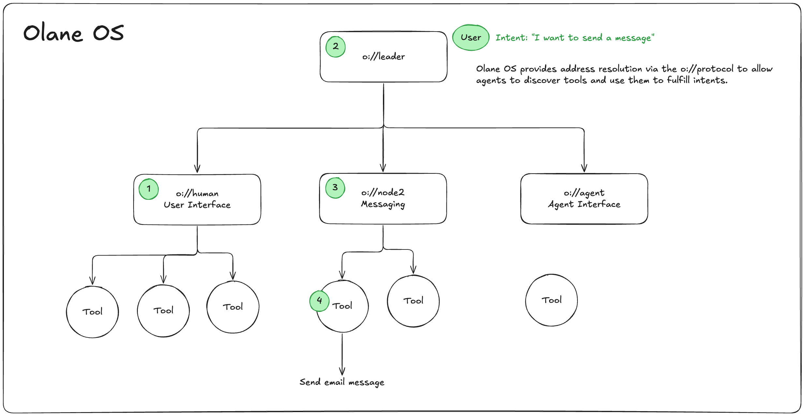

# Olane OS

**A modular operating system where humans or AI agents are the user, and applications are nodes.**

[](https://www.npmjs.com/package/@olane/o-core)
[](#license)
[](https://olane.com/docs)

---

## TL;DR

Olane OS is the shared workspace for AI, humans and tools. Build your hyper-personalized AI environment and let agents do MORE *with* you.

**What makes Olane different?** While other frameworks require you to pre-define workflows upfront (LangGraph's StateGraph, n8n's visual DAGs, CrewAI's fixed crews), Olane enables **emergent workflows** that discover optimal paths through execution and learn from experience.

---

## Table of Contents

- [Why Olane OS?](#why-olane-os) - Key differentiators
- [What is Olane OS?](#what-is-olane-os) - Core concepts
- [Quick Start](#quick-start) - Get running in 5 minutes
- [Documentation](#documentation) - Guides and API reference
- [Framework Comparison](#framework-comparison) - vs LangGraph, n8n, CrewAI
- [Community](#community--support) - Get help and contribute

---

## Why Olane OS?

### 🔄 Emergent Workflows (Not Prebuilt)

Unlike LangGraph's StateGraph, n8n's visual DAGs, or CrewAI's fixed crews, **workflows emerge through execution** and learn optimal paths over time.

<table>
<tr>
<td width="50%">

**Other Frameworks**
```typescript
// Pre-define entire workflow
const workflow = new StateGraph({
  nodes: ['fetch', 'analyze', 'report'],
  edges: [/* wire connections */]
});
```
❌ Rigid, brittle, no learning

</td>
<td width="50%">

**Olane OS**
```typescript
// Send intent, workflow emerges
await node.use({
  method: 'intent',
  params: { intent: 'Analyze Q4 data' }
});
```
✅ Adaptive, learning, resilient

</td>
</tr>
</table>

[**Learn more about emergent workflows →**](/docs/concepts/emergent-workflows)

---

### 🤖 Agent-Agnostic Design

Build once and serve **both human users** (CLI/web) and **AI agents** (programmatic) through the same natural language interface.

```typescript
// Same tool node serves both agent types
await toolNode.use({ method: 'intent', params: { intent: 'Create report' } });

// Human via CLI: $ olane intent "Create report"
// AI programmatically: await toolNode.use({ method: 'intent', ... })
```

[**Learn more about agent-agnostic design →**](/docs/agents/agent-agnostic-design)

---

### 🧠 Generalist-Specialist Architecture

One LLM brain + many specialized tool nodes. No fine-tuning needed—specialization through context injection and tool augmentation.

```
Agent (GPT-4/Claude) → Coordinates → Specialized Tool Nodes
                                    ├─ o://finance/analyst
                                    ├─ o://data/pipeline  
                                    └─ o://customer/crm
```

[**Learn more about the architecture →**](/docs/concepts/architecture)

---

### 🌐 P2P Discovery & Coordination

Self-organizing mesh networks via libp2p. Tool nodes automatically discover each other—no manual configuration.

```typescript
// Tools auto-register and become discoverable
const nodes = await leader.search({ capability: 'financial_analysis' });
// Instant discovery across the network
```

[**Learn more about networking →**](/packages/o-node/README.md)

```typescript
// Create an OS instance with a tool node
const os = new OlaneOS();
await os.start();

// Agents send natural language intents
const result = await os.use(
  new oAddress('o://messaging'),
  {
    method: 'intent',
    params: {
      intent: 'Send an email to dillon explaining what Olane OS is'
    }
  }
);
```


**What just happened?** The tool node accepted natural language, autonomously determined which tools to use, coordinated multi-step analysis, and returned results—no pre-defined workflows required.




---

## What is Olane OS?

An operating system where **agents are the users** and **tool nodes are the applications**.

| Traditional Software | Olane OS |
|---------------------|----------|
| Users = Humans | **Users = Agents** (human or AI) |
| Apps = Fixed programs | **Apps = Tool Nodes** (discoverable capabilities) |
| Communication = APIs | **Communication = Natural language** |
| Workflows = Pre-defined | **Workflows = Emergent** |

**Core Concepts:**
- 🤖 **Agents** - Humans (CLI/web) or AI (GPT-4/Claude) expressing goals
- 🛠️ **Tool Nodes** - Specialized capabilities you build (`o://finance`, `o://crm`)
- 🌐 **o:// Protocol** - Hierarchical addressing like URLs
- 🔄 **Emergent Workflows** - Discovered through execution, not hardcoded

[**Deep dive into architecture →**](/docs/concepts/architecture)

---

## Quick Start

1. Install the `olane` cli tool
```bash
npm install -g @olane/o-cli
```

2. Run the `olane` command
```bash
olane
```

3. Configure AI & add MCP tools
```bash
> Add the Linear MCP server with API Key "XYZ"
> Add the Filesystem MCP server for the directory "/Users/me/Development/project123"
```

4. Connect your OS to other tools
```bash
> Add Olane to cursor
> Add Olane Claude Code
```

---

## Documentation

| Category | Links |
|----------|-------|
| 🚀 **Getting Started** | [Installation](./docs/getting-started/installation.mdx) • [Quick Start](./docs/getting-started/quickstart.mdx) • [Core Concepts](./docs/concepts/overview.mdx) |
| 🎯 **Key Features** | [Emergent Workflows](/docs/concepts/emergent-workflows.mdx) • [Agent-Agnostic Design](./docs/agents/agent-agnostic-design.mdx) • [Architecture](./docs/concepts/architecture.mdx) |
| 📦 **Packages** | [o-core](./packages/o-core/) • [o-node](./packages/o-node/) • [o-tool](./packages/o-tool/) • [o-lane](./packages/o-lane/) • [o-leader](./packages/o-leader/) • [o-os](./packages/o-os/) |
| 📖 **Guides** | [Building Tool Nodes](./docs/guides/building-tool-nodes.mdx) • [Multi-Node Apps](./docs/guides/multi-node-applications.mdx) • [Testing](./docs/guides/testing.mdx) |
| 💡 **Examples** | [Financial Analyst](./examples/financial-analyst) • [CRM Application](./examples/crm-application) • [All Examples](./examples/) |
| 🔄 **Comparisons** | [vs LangGraph](./docs/comparisons/langgraph.mdx) • [vs CrewAI](./docs/comparisons/crewai.mdx) • [All Frameworks](./docs/comparisons/frameworks.mdx) |

[**📚 Browse all documentation →**](https://olane.com/docs)

---

## Architecture

Olane OS uses a **three-layer architecture**:

```
Agents (humans/AI) → Tool Nodes (your apps) → Olane OS (infrastructure)
```

| Layer | What It Is | Examples |
|-------|-----------|----------|
| **Agents** | Intelligent users | Humans (CLI/web), AI (GPT-4/Claude) |
| **Tool Nodes** | Applications you build | `o://finance/analyst`, `o://crm/customers` |
| **Olane OS** | Runtime infrastructure | Discovery, routing, networking |

[**Read the architecture guide →**](/docs/concepts/architecture) | [**Package details →**](/docs/packages/overview)

---

## Framework Comparison

| Feature | LangGraph | n8n | CrewAI | **Olane OS** |
|---------|-----------|-----|--------|----------|
| **Workflows** | Pre-defined StateGraph | Visual DAG | Fixed crews | **Emergent patterns** |
| **Flexibility** | Update graph manually | Rewire canvas | Redefine roles | **Adapts automatically** |
| **Learning** | Per-workflow only | Template-based | Limited | **Cross-execution** |
| **Discovery** | Manual wiring | Manual config | Manual config | **Automatic P2P** |
| **Agents** | Python only | Visual + code | AI only | **Human + AI** |
| **Scaling** | Vertical | Vertical | Vertical | **Horizontal** |

**Need more details?** Read the [in-depth framework comparison →](/docs/comparisons/frameworks) or [emergent workflows guide →](/docs/concepts/emergent-workflows)

---

## Community & Support

- **📚 Documentation**: [olane.com/docs](https://olane.com/docs)
- **💬 GitHub Discussions**: [github.com/olane-labs/olane/discussions](https://github.com/olane-labs/olane/discussions)
- **🐛 GitHub Issues**: [github.com/olane-labs/olane/issues](https://github.com/olane-labs/olane/issues)
- **💬 Discord**: [discord.gg/olane](https://discord.gg/olane)
- **📧 Email**: support@olane.io

---

## Contributing

We welcome contributions! See our [Contributing Guide](./CONTRIBUTING.md) for details.

**Areas for contribution:**
- Tool nodes and integrations
- Documentation and tutorials
- Core package improvements
- Real-world examples
- Bug fixes and performance

---

## License

Olane OS is dual-licensed under your choice of:

- **[MIT License](LICENSE-MIT)** - Simple, permissive license
- **[Apache License 2.0](LICENSE-APACHE)** - Permissive license with patent protection

**Why dual licensing?** Choose MIT for simplicity or Apache 2.0 for explicit patent grants. See [LICENSE](./LICENSE) for details.

Unless you explicitly state otherwise, any contribution intentionally submitted for inclusion shall be dual-licensed as above, without additional terms.

---

**Ready to build?** 
- 🚀 [Quick Start Guide](#quick-start)
- 📚 [Full Documentation](https://olane.com/docs)
- 💡 [Browse Examples](./examples/)
- 💬 [Join Discord](https://discord.gg/olane)

Copyright © 2025 Olane Inc.
