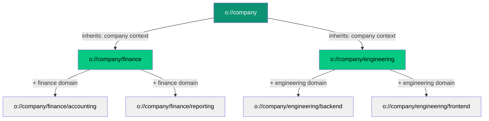

# Hierarchical Addressing (o://)

Transform your AI agent architecture from a flat, unstructured network into an organized, intelligent hierarchy where agents naturally inherit context, discover capabilities, and communicate efficiently through filesystem-like addressing.

<Note>
**Reading time:** 5 minutes | **Perfect for:** AI architects, developers building multi-agent systems, and engineers familiar with DNS or filesystem concepts
</Note>

## The Problem with Flat Agent Networks

Traditional AI agent frameworks treat agents as isolated, flat entities with no inherent organization:

<Tabs>
<Tab title="Traditional Approach">
```python
# Flat, unorganized agent identifiers
agent_1 = "payment-processor-prod-us-east-1a"
agent_2 = "invoice-analyzer-v2-3"
agent_3 = "customer-support-bot-final"

# Manual service discovery
services = {
    "payment-processor-prod-us-east-1a": "10.0.1.45:8080",
    "invoice-analyzer-v2-3": "10.0.2.33:9000",
    "customer-support-bot-final": "10.0.3.22:7000"
}

# No context inheritance or hierarchy
# Every agent starts from scratch
agent.send_request(
    target="invoice-analyzer-v2-3",
    context="You are a financial analyst..."  # Repeated for every agent
)
```

**Problems:**
- ❌ No organizational structure or relationships
- ❌ Context must be manually injected for every agent
- ❌ Service discovery requires external registries  
- ❌ No natural routing or delegation patterns
- ❌ Difficult to understand agent relationships
- ❌ No automatic fault tolerance paths
</Tab>

<Tab title="Hierarchical Approach (Olane OS)">
```typescript
// Organized, hierarchical addresses with automatic context
const paymentProcessor = new oAddress('o://company/finance/payments/processor');
const invoiceAnalyzer = new oAddress('o://company/finance/accounting/invoice-analyzer');
const supportBot = new oAddress('o://company/support/customer-service');

// Automatic context inheritance from hierarchy
// o://company/finance inherits: company context + finance domain knowledge
// o://company/finance/accounting inherits: company + finance + accounting expertise

// Natural discovery through hierarchy
const financeAgents = await agent.discover('o://company/finance/');
// Returns: payments, accounting, reporting agents automatically

// Intelligent routing with fallback
await agent.use('o://company/finance/payments/processor', {
  method: 'process_payment',
  params: { amount: 1000 }
});
// If processor unavailable → routes to parent (o://company/finance/payments)
// Parent can delegate to sibling or handle directly
```

**Benefits:**
- ✅ Clear organizational hierarchy mirrors business structure
- ✅ Context inheritance reduces redundancy
- ✅ Automatic service discovery through address exploration
- ✅ Built-in routing with hierarchical fallbacks
- ✅ Transparent agent relationships
- ✅ Natural fault tolerance patterns
</Tab>
</Tabs>

## Core Concepts

### 1. **The o:// Protocol**

Olane OS uses a URI-like addressing scheme similar to filesystems or URLs:

<CodeGroup>
```typescript Basic Syntax
// Format: o://domain/path/to/agent
const address = new oAddress('o://company/engineering/backend/api-service');

// Components
console.log(address.root);       // "o://company"
console.log(address.paths);      // "company/engineering/backend/api-service"  
console.log(address.protocol);   // "/o/company/engineering/backend/api-service"
```

```typescript System Addresses
// Special reserved addresses
const leader = oAddress.leader();      // o://leader (network coordinator)
const registry = oAddress.registry();  // o://registry (service directory)
const lane = oAddress.lane();         // o://lane (process manager)
```

```typescript Address Operations
// Create and manipulate addresses
const parent = new oAddress('o://company/engineering');
const child = new oAddress('o://company/engineering/backend');

// Check relationships
console.log(child.root === parent.root);  // true

// Convert formats
const staticAddr = child.toStaticAddress();  // o://backend
const cid = await child.toCID();            // Content-addressed identifier
```
</CodeGroup>

<Info>
**Think of o:// like file paths:** Just as `/home/user/documents/report.pdf` shows where a file lives, `o://company/finance/accounting` shows where an agent lives in your organization's hierarchy.
</Info>

### 2. **Hierarchical Organization**

Addresses naturally express organizational structure and domain boundaries:

<Frame caption="Agents organized in hierarchical domains with automatic context inheritance">

</Frame>

**Context Inheritance Example:**

<Steps>
<Step title="Root Level Context">
Agent at `o://company` has base organizational context
```typescript
context: {
  organization: "Acme Corp",
  values: ["customer-first", "innovation"],
  policies: {...}
}
```
</Step>

<Step title="Domain Level Inherits">
Agent at `o://company/finance` inherits company context + adds domain knowledge
```typescript
context: {
  organization: "Acme Corp",        // inherited
  values: ["customer-first", ...],  // inherited
  policies: {...},                  // inherited
  domain: "finance",                // added
  regulations: ["SOX", "GAAP"],     // added
  financialYearEnd: "Dec 31"        // added
}
```
</Step>

<Step title="Service Level Inherits All">
Agent at `o://company/finance/accounting` inherits everything above + specialization
```typescript
context: {
  organization: "Acme Corp",        // inherited
  values: [...],                    // inherited  
  policies: {...},                  // inherited
  domain: "finance",                // inherited
  regulations: ["SOX", "GAAP"],     // inherited
  financialYearEnd: "Dec 31",       // inherited
  specialization: "accounting",     // added
  tools: ["ledger", "reconcile"],   // added
  chartOfAccounts: {...}            // added
}
```
</Step>
</Steps>

### 3. **Intelligent Routing**

Addresses enable smart routing with automatic fallback and delegation:

<Tabs>
<Tab title="Direct Routing">
```typescript
// Agent knows exact destination
const result = await agent.use('o://company/finance/payments', {
  method: 'process_refund',
  params: { orderId: '12345', amount: 50 }
});

// Routing: current → o://company/finance/payments (direct)
```
</Tab>

<Tab title="Hierarchical Discovery">
```typescript
// Agent doesn't know exact address, discovers through hierarchy
const result = await agent.use('o://company/finance/', {
  method: 'get_quarterly_report',
  params: { quarter: 'Q4', year: 2024 }
});

// Routing: 
// 1. Contact o://company/finance (parent)
// 2. Parent routes to appropriate child (reporting)
// 3. o://company/finance/reporting handles request
```
</Tab>

<Tab title="Automatic Fallback">
```typescript
// Target agent unavailable - automatic recovery
try {
  const result = await agent.use('o://company/finance/accounting', {
    method: 'reconcile_accounts'
  });
} catch (error) {
  // System automatically:
  // 1. Tries o://company/finance/accounting (FAILED)
  // 2. Falls back to o://company/finance (parent)
  // 3. Parent delegates to sibling or handles directly
  // 4. No manual intervention needed
}
```
</Tab>

<Tab title="Sibling Routing">
```typescript
// Route between agents at same level
const backend = new oAddress('o://company/engineering/backend');
const frontend = new oAddress('o://company/engineering/frontend');

// Backend needs to notify frontend
await backend.use('o://company/engineering/frontend', {
  method: 'api_updated',
  params: { version: 'v2', breakingChanges: [...] }
});

// Routing: backend → parent (engineering) → frontend
```
</Tab>
</Tabs>

### 4. **Static vs Dynamic Addresses**

Olane OS supports both absolute and relative addressing:

<CardGroup cols={2}>
<Card title="Dynamic Addresses" icon="route">
**Full hierarchical path**

```typescript
new oAddress('o://company/finance/accounting')
```

- Contains complete hierarchy
- Enables parent-child routing
- Inherits full context chain
- Used for specific agent references
</Card>

<Card title="Static Addresses" icon="location-dot">
**Leaf name only**

```typescript
new oAddress('o://accounting')
```

- Just the agent name
- Routes through leader/registry
- Lighter weight, less context
- Used for well-known services
</Card>
</CardGroup>

<Accordion title="When to use each address type">
**Use Dynamic Addresses when:**
- Building hierarchical agent organizations
- Want automatic context inheritance
- Need hierarchical routing and fallback
- Agents have parent-child relationships

**Use Static Addresses when:**
- Agent is globally unique
- No context inheritance needed
- Direct point-to-point communication
- Simple service discovery via registry
</Accordion>

## Business Impact

### **Reduced Complexity**

<Tabs>
<Tab title="Traditional (Manual Context)">
```typescript
// Context must be provided for every agent
const financialAnalyst = new Agent({
  name: "analyst-1",
  context: `You are a financial analyst at Acme Corp.
  You follow SOX and GAAP regulations.
  The financial year ends December 31.
  You specialize in quarterly reporting.
  You have access to ledger and analytics tools.
  You report to the CFO.`
});

const accountant = new Agent({
  name: "accountant-1", 
  context: `You are an accountant at Acme Corp.
  You follow SOX and GAAP regulations.
  The financial year ends December 31.
  You specialize in account reconciliation.
  You have access to ledger and reconciliation tools.
  You report to the CFO.`  // 80% duplicate context!
});
```

**Problems:**
- Massive context duplication across agents
- Manual updates when organization changes
- Inconsistencies between agent contexts
- High LLM token costs from repeated context
</Tab>

<Tab title="Hierarchical (Automatic Context)">
```typescript
// Context defined once at appropriate level
const financeRoot = new oNode({
  address: new oAddress('o://company/finance'),
  context: `Domain: Finance
  Regulations: SOX, GAAP
  Financial Year: Dec 31
  Reports to: CFO`
});

// Children automatically inherit parent context
const analyst = new oNode({
  address: new oAddress('o://company/finance/reporting'),
  context: `Specialization: Quarterly Reports
  Tools: analytics, visualization`
  // Inherits: company, finance, regulations, fiscal year
});

const accountant = new oNode({
  address: new oAddress('o://company/finance/accounting'),
  context: `Specialization: Reconciliation  
  Tools: ledger, reconciliation`
  // Inherits: company, finance, regulations, fiscal year
});
```

**Benefits:**
- Define context once, use everywhere
- Automatic propagation to children
- Single source of truth for domain knowledge
- **70-80% reduction in context tokens**
</Tab>
</Tabs>

### **Natural Organization**

<CardGroup cols={2}>
<Card title="Mirrors Business Structure" icon="sitemap">
Your agent hierarchy naturally reflects your organizational chart, making it intuitive for teams to understand and maintain
</Card>

<Card title="Clear Ownership" icon="users">
Address hierarchy clearly shows which team or department owns which agents, simplifying governance and access control
</Card>

<Card title="Automatic Scaling" icon="arrow-up-right-dots">
Add new departments or teams by extending the hierarchy - existing patterns and routing work automatically
</Card>

<Card title="Built-in Fault Tolerance" icon="shield-halved">
Hierarchical routing provides automatic fallback paths when agents are unavailable - no manual failover logic needed
</Card>
</CardGroup>

### **Developer Experience**

<Steps>
<Step title="Intuitive Discovery">
```typescript
// Find all finance agents
const financeAgents = await discover('o://company/finance/');

// Find all engineering agents  
const engineeringAgents = await discover('o://company/engineering/');
```
Hierarchical addresses make discovery intuitive - you know where to look
</Step>

<Step title="Clear Communication Paths">
```typescript
// Communication intent is clear from address
await agent.use('o://company/legal/contracts', { 
  method: 'review_contract' 
});
```
No guessing what an agent does - the address structure tells you
</Step>

<Step title="Automatic Routing">
```typescript
// No manual routing logic needed
await agent.use('o://company/finance/payments', {...});
// System handles: discovery, connection, fallback, retry
```
Framework handles all routing complexity automatically
</Step>
</Steps>

## Real-World Example

Here's how a financial services company might structure their agents:

```typescript
// Company root
o://acme-financial

  // Business divisions
  ├── o://acme-financial/retail-banking
  │   ├── o://acme-financial/retail-banking/accounts
  │   ├── o://acme-financial/retail-banking/loans
  │   └── o://acme-financial/retail-banking/customer-service
  │
  ├── o://acme-financial/investment-banking
  │   ├── o://acme-financial/investment-banking/trading
  │   ├── o://acme-financial/investment-banking/research
  │   └── o://acme-financial/investment-banking/portfolio-management
  │
  └── o://acme-financial/operations
      ├── o://acme-financial/operations/compliance
      ├── o://acme-financial/operations/risk-management
      └── o://acme-financial/operations/reporting
```

**Benefits in Practice:**

<AccordionGroup>
<Accordion title="Context Inheritance in Action">
All agents under `o://acme-financial/investment-banking/` automatically inherit:
- Company policies and brand guidelines
- Financial regulations (SEC, FINRA)
- Investment banking domain knowledge
- Risk management protocols
- Reporting requirements

Without writing this context multiple times.
</Accordion>

<Accordion title="Intelligent Routing Example">
When `o://acme-financial/retail-banking/customer-service` needs to check account balance:

```typescript
// Customer service agent (doesn't know exact accounts API)
await this.use('o://acme-financial/retail-banking/', {
  method: 'get_account_balance',
  params: { accountId: '12345' }
});

// System automatically:
// 1. Routes to parent: o://acme-financial/retail-banking
// 2. Parent identifies accounts child handles this
// 3. Routes to: o://acme-financial/retail-banking/accounts
// 4. Accounts agent processes request
// 5. Response flows back through hierarchy
```
No manual service mesh configuration needed!
</Accordion>

<Accordion title="Automatic Failover">
If `o://acme-financial/operations/compliance` goes down:

```typescript
// Request to compliance agent
await agent.use('o://acme-financial/operations/compliance', {
  method: 'check_transaction'
});

// Automatic failover:
// 1. Try compliance agent (DOWN)
// 2. Route to parent: o://acme-financial/operations
// 3. Operations parent can:
//    - Handle with general compliance rules
//    - Delegate to backup compliance instance
//    - Queue for when compliance returns
// 4. No service disruption!
```
</Accordion>
</AccordionGroup>

## When to Use Hierarchical Addressing

### ✅ **Perfect For:**

<CardGroup cols={2}>
<Card title="Multi-Agent Organizations" icon="network-wired">
When you have many agents that naturally group by domain, department, or function
</Card>

<Card title="Context-Heavy Domains" icon="brain">
When agents need rich domain context that varies by organizational position
</Card>

<Card title="Scalable Architectures" icon="diagram-project">
When you need to grow from 10 agents to 100+ without architectural changes
</Card>

<Card title="Enterprise Systems" icon="building">
When your AI system mirrors a business organization with clear hierarchies
</Card>
</CardGroup>

### ⚠️ **Consider Alternatives When:**

<AccordionGroup>
<Accordion title="Simple Two-Agent Systems">
If you only have 2-3 agents with no organizational structure, hierarchical addressing might be overkill.

**Better choice:** Static addresses with direct communication
</Accordion>

<Accordion title="Flat, Peer-to-Peer Networks">
If all agents are truly equal peers with no hierarchy or domain boundaries.

**Better choice:** Traditional service mesh with direct addressing
</Accordion>

<Accordion title="External API Integration">
When integrating existing external services that don't fit hierarchical organization.

**Better choice:** Use tool wrappers with static addresses like `o://external-api`
</Accordion>
</AccordionGroup>

## Key Addressing Patterns

<Tabs>
<Tab title="Domain Organization">
```typescript
// Group by business domain
o://company/sales/       // Sales agents
o://company/marketing/   // Marketing agents  
o://company/support/     // Support agents

// Each domain has own context, tools, permissions
```
</Tab>

<Tab title="Functional Layers">
```typescript
// Group by function/layer
o://platform/data/      // Data layer agents
o://platform/api/       // API layer agents
o://platform/ui/        // UI layer agents

// Clear separation of concerns
```
</Tab>

<Tab title="Geographic Distribution">
```typescript
// Group by region
o://global/us-east/     // US East agents
o://global/eu-west/     // EU West agents
o://global/asia-pac/    // Asia Pacific agents

// Regional context and compliance
```
</Tab>

<Tab title="Environment Isolation">
```typescript
// Group by environment
o://prod/              // Production agents
o://staging/           // Staging agents
o://dev/               // Development agents

// Complete isolation between envs
```
</Tab>
</Tabs>

## Getting Started

Ready to organize your agents hierarchically? Choose your path:

<CardGroup cols={2}>
<Card title="Quickstart Guide" icon="rocket" href="/concepts/addressing/quickstart">
Create your first hierarchical agent network in 10 minutes
</Card>

<Card title="Address Format Reference" icon="book" href="/concepts/addressing/address-format">
Complete specification of the o:// protocol and address syntax
</Card>

<Card title="Routing Deep Dive" icon="route" href="/concepts/addressing/routing">
Learn how intelligent routing works through hierarchies
</Card>

<Card title="Best Practices" icon="star" href="/concepts/addressing/best-practices">
Design patterns and conventions for production hierarchies
</Card>
</CardGroup>

<Tip>
**Start simple:** Begin with a shallow 2-3 level hierarchy (company/domain/agent) and expand as your needs grow. You can always refactor addresses later.
</Tip>

<Info>
**Migration tip:** If you have existing flat agent systems, start by grouping them into logical domains using addresses, then gradually add hierarchical communication patterns. See our [migration guide](/migration/monolithic-to-specialist) for step-by-step instructions.
</Info>

## Next Steps

<Steps>
<Step title="Learn the Syntax">
Read [Address Format](/concepts/addressing/address-format) to understand o:// protocol syntax and validation rules
</Step>

<Step title="Build Your First Hierarchy">
Follow the [Quickstart](/concepts/addressing/quickstart) to create a working hierarchical agent network
</Step>

<Step title="Master Routing">
Dive into [Routing](/concepts/addressing/routing) to understand how messages flow through hierarchies
</Step>

<Step title="Explore Patterns">
Review [Best Practices](/concepts/addressing/best-practices) for production-ready hierarchy design
</Step>
</Steps>
