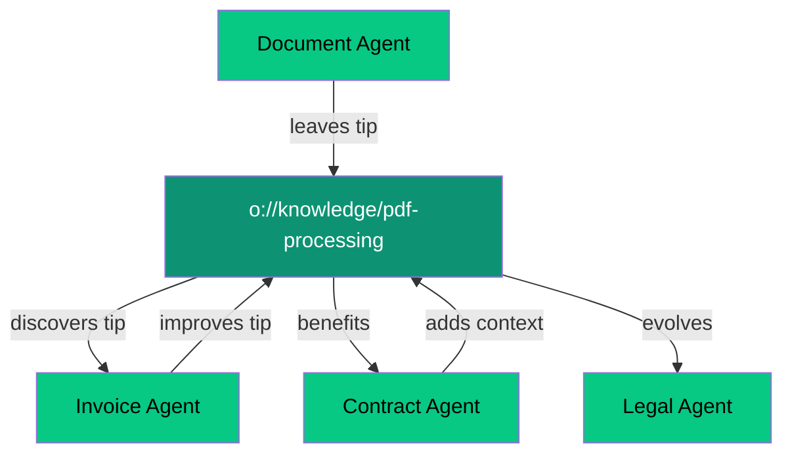

# Emergent Intelligence

Transform your AI systems from rigid, pre-programmed workflows to organic, learning-based intelligence that grows smarter over time through agent collaboration and knowledge sharing.

<Note>
**Reading time:** 5 minutes | **Perfect for:** Technical decision makers, AI architects, and developers evaluating orchestration approaches
</Note>

## The Problem with Explicit Orchestration

Traditional AI frameworks like LangGraph require you to design everything upfront:

<Tabs>
<Tab title="Traditional Approach (LangGraph)">
```python
# Pre-defined workflow - everything must be planned
from langgraph import StateGraph

# Define rigid state schema
class AgentState(TypedDict):
    messages: List[str]
    next_action: str
    workflow_step: int

# Build explicit graph structure
workflow = StateGraph(AgentState)
workflow.add_node("research", research_agent)
workflow.add_node("analyze", analysis_agent) 
workflow.add_node("write", writing_agent)

# Manual connections - no flexibility
workflow.add_edge("research", "analyze")
workflow.add_edge("analyze", "write")
```

**Limitations:**
- ❌ Requires upfront workflow design
- ❌ Learning confined to predefined structures  
- ❌ Knowledge sharing needs explicit engineering
- ❌ Scaling requires manual graph restructuring
- ❌ No organic capability discovery
</Tab>

<Tab title="Emergent Approach (Olane OS)">
```typescript
// Agents discover what they need organically
class ResearchAgent extends oCore {
  constructor() {
    super({
      address: new oAddress('o://research/academic'),
      type: NodeType.AGENT
    });
  }
  
  async execute(request) {
    // Agent explores and discovers capabilities
    const analysisCapabilities = await this.discoverCapabilities('o://analysis/');
    
    // Leaves knowledge for other agents to find
    await this.leaveKnowledgeArtifact({
      room: 'o://knowledge/research-patterns',
      insight: 'Academic papers need citation verification',
      context: request.domain
    });
    
    // Dynamically coordinates with discovered agents
    return await this.collaborateWith(analysisCapabilities, request);
  }
}
```

**Benefits:**
- ✅ No upfront workflow design needed
- ✅ Agents learn and adapt continuously
- ✅ Knowledge flows naturally between agents
- ✅ Auto-scaling through organic discovery
- ✅ Emergent capability combinations
</Tab>
</Tabs>

## Core Concepts of Emergent Intelligence

### 1. **Knowledge Artifacts**

Agents leave "breadcrumbs" of wisdom for others to discover and build upon.

<CardGroup cols={2}>
<Card title="What They Are" icon="lightbulb">
Structured insights, tips, and learnings that agents deposit in shared knowledge spaces
</Card>

<Card title="How They Work" icon="arrows-rotate">
Future agents discover these artifacts and incorporate the learnings into their own decision-making
</Card>
</CardGroup>

```typescript
// Agent leaves knowledge after completing a task
await agent.leaveKnowledgeArtifact({
  room: 'o://knowledge/document-processing',
  insight: 'PDF tables extract better with tabula-py than pdfplumber',
  confidence: 0.95,
  context: { documentType: 'financial-reports', pageCount: '>10' },
  usage: { successRate: '94%', timeSaved: '3.2s per page' }
});
```

### 2. **"Rooms with Tips"**

Agents enter resource spaces and discover accumulated wisdom from previous agent experiences.

<Steps>
<Step title="Agent Enters Room">
When an agent needs a capability, it explores relevant address spaces (rooms)

```typescript
const tips = await agent.enterRoom('o://knowledge/data-extraction');
```
</Step>

<Step title="Discovers Accumulated Tips">
The room contains insights left by previous agents who solved similar problems

```typescript
// Agent finds tips like:
// "Use regex pattern \\d{3}-\\d{3}-\\d{4} for phone numbers"
// "OCR accuracy improves 23% with image preprocessing"
// "Cache extraction rules - 67% of documents follow same patterns"
```
</Step>

<Step title="Applies & Improves">
Agent applies discovered knowledge and adds its own learnings

```typescript
await agent.improveRoom('o://knowledge/data-extraction', {
  newTip: 'Email extraction: look for @ symbols, then validate with regex',
  improvedTip: 'Phone regex works for US, added international: +\\d{1,3}[\\s-]?...',
  validation: { tested: 1000, accuracy: '97.3%' }
});
```
</Step>
</Steps>

### 3. **Cross-Agent Learning**

Knowledge flows between different agent types without explicit programming.

<Frame caption="Knowledge flows organically across agent types and domains">

</Frame>

**Example Flow:**
1. **Document Agent** discovers that preprocessing images improves OCR accuracy
2. **Invoice Agent** finds this tip and applies it to invoice processing  
3. **Contract Agent** builds on this, adding legal document-specific preprocessing
4. **Legal Agent** inherits all accumulated preprocessing wisdom automatically

### 4. **Dynamic Workflow Discovery**

Instead of pre-defining workflows, agents discover optimal collaboration patterns through exploration.

<Tabs>
<Tab title="Traditional Workflow">
```yaml
# Fixed, pre-defined workflow
workflow:
  steps:
    - name: extract
      agent: document-extractor
    - name: validate  
      agent: data-validator
    - name: process
      agent: business-processor
  
  connections:
    extract -> validate -> process
```

**Problems:**
- Rigid sequence that can't adapt
- No learning from experience
- Manual updates required for improvements
</Tab>

<Tab title="Emergent Workflow">
```typescript
// Workflow emerges from agent exploration
class DocumentProcessor extends oCore {
  async processDocument(doc) {
    // Discover what capabilities exist
    const extractors = await this.discover('o://services/extraction/');
    const validators = await this.discover('o://services/validation/');
    
    // Try different combinations and learn what works
    const bestApproach = await this.learnOptimalFlow({
      document: doc,
      availableServices: [...extractors, ...validators],
      previousExperience: await this.getKnowledge('o://knowledge/document-flows')
    });
    
    // Execute discovered workflow and improve it
    return await this.executeAndLearn(bestApproach, doc);
  }
}
```

**Benefits:**
- Adapts to new document types automatically
- Learns from each processing experience  
- Discovers optimal agent combinations
- Improves performance over time
</Tab>
</Tabs>

## Business Impact

### **Reduced Development Time**
<CardGroup cols={2}>
<Card title="Traditional: 6-8 weeks" icon="clock">
- Design workflow graphs
- Define state schemas  
- Program agent interactions
- Test all combinations
- Handle edge cases manually
</Card>

<Card title="Emergent: 1-2 weeks" icon="rocket">
- Create basic agents
- Define knowledge spaces
- Let agents discover patterns
- System improves automatically
- Edge cases handled organically
</Card>
</CardGroup>

### **Continuous Improvement**
Unlike static workflows, emergent systems get smarter with every interaction:

- **Week 1:** Basic agent interactions, 60% task success rate
- **Week 4:** Agents discover optimal patterns, 85% success rate  
- **Week 12:** Rich knowledge artifacts, 94% success rate
- **Week 24:** Sophisticated collaboration patterns, 97% success rate

### **Cost Efficiency**
<Tabs>
<Tab title="Development Costs">
- **75% less** initial development time
- **90% less** maintenance overhead
- **Zero** workflow redesign costs
- **Automatic** optimization without engineering
</Tab>

<Tab title="Operational Costs">
- **Intelligent load balancing** - agents discover optimal resource usage
- **Automatic scaling** - new agents join organically
- **Reduced failures** - accumulated wisdom prevents known issues
- **Self-healing** - agents learn from failures and adapt
</Tab>
</Tabs>

## When to Choose Emergent Intelligence

### ✅ **Perfect For:**

<AccordionGroup>
<Accordion title="Complex, evolving problem domains">
When you can't predict all the patterns upfront, emergent systems adapt and learn optimal approaches organically.

**Examples:** Document processing with many formats, customer support with evolving issues, research tasks with unknown patterns.
</Accordion>

<Accordion title="Long-running systems that need to improve">
Systems that run continuously benefit from accumulated learning and knowledge sharing between agents.

**Examples:** Production AI pipelines, customer service systems, data processing platforms.
</Accordion>

<Accordion title="Multi-domain knowledge sharing">
When insights from one domain can benefit agents in related domains through cross-pollination.

**Examples:** Legal document processing benefiting from general document insights, customer support agents sharing resolution patterns.
</Accordion>

<Accordion title="Cost-sensitive deployments">
When you need maximum ROI from AI development and want systems that improve without additional engineering.

**Examples:** Startups with limited engineering resources, enterprise systems needing high efficiency.
</Accordion>
</AccordionGroup>

### ❌ **Not Ideal For:**

<AccordionGroup>
<Accordion title="Highly regulated workflows">
When compliance requires explicit, auditable workflow definitions that can't change without approval.

**Better choice:** Explicit orchestration with LangGraph or similar frameworks.
</Accordion>

<Accordion title="Simple, well-defined tasks">
When the problem is fully understood and doesn't require learning or adaptation.

**Better choice:** Direct API calls or simple automation tools.
</Accordion>

<Accordion title="Real-time, low-latency requirements">
When discovery and learning overhead can't be tolerated due to strict timing requirements.

**Better choice:** Pre-optimized, static workflows.
</Accordion>
</AccordionGroup>

## Emergent vs Explicit: The Philosophy

<Tabs>
<Tab title="Explicit Orchestration Philosophy">
**"Engineer intelligence upfront"**

- Intelligence is designed and programmed
- Workflows are predetermined and static
- Knowledge sharing requires explicit design
- Scaling requires manual restructuring
- Learning happens within predefined boundaries

**Best for:** Well-understood, stable problem domains with clear requirements
</Tab>

<Tab title="Emergent Intelligence Philosophy">
**"Cultivate intelligence over time"**

- Intelligence emerges from agent interactions
- Workflows develop organically through experience
- Knowledge sharing happens naturally
- Scaling occurs through organic discovery
- Learning transcends original design boundaries  

**Best for:** Complex, evolving domains where optimal patterns aren't known upfront
</Tab>
</Tabs>

## Getting Started

Ready to experience emergent intelligence? Choose your path:

<CardGroup cols={2}>
<Card title="15-Minute Quickstart" icon="rocket" href="/emergent/quickstart">
Build your first emergent agent system with knowledge sharing and organic discovery
</Card>

<Card title="Compare with LangGraph" icon="arrows-left-right" href="/emergent/vs-langgraph">
Side-by-side comparison showing the differences in approach and outcomes
</Card>

<Card title="See Real Examples" icon="code" href="/examples/complex-task-coordination">
Explore production systems using emergent intelligence patterns
</Card>

<Card title="Migration Guide" icon="arrow-right" href="/migration/from-langgraph">
Step-by-step guide to migrate from explicit orchestration frameworks
</Card>
</CardGroup>

<Tip>
**New to AI orchestration?** Start with our [quickstart guide](/emergent/quickstart) to see emergent intelligence in action. You'll build a system where agents discover and share knowledge organically.
</Tip>

<Info>
**Questions about fit?** Emergent intelligence works best when you have evolving requirements, need continuous improvement, or want to minimize ongoing development costs. Check our [comparison guide](/comparison/vs-explicit-orchestration) for detailed decision criteria.
</Info>
