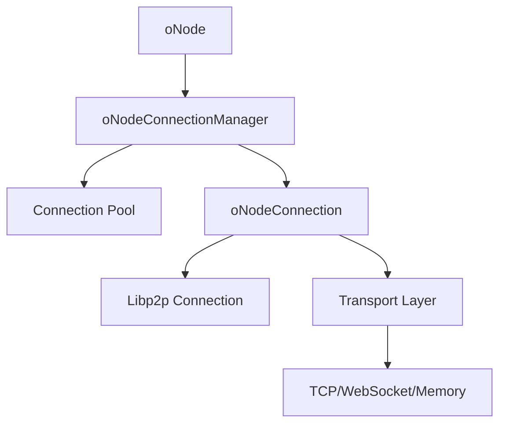

# oNode Connection System

The oNode connection system provides robust, efficient peer-to-peer communication through connection pooling, transport abstraction, and automatic connection management. It handles the complexities of libp2p networking while providing a simple interface for node-to-node communication.

## Architecture Overview

The connection system consists of three main components:

1. **oNodeConnectionManager** - Manages connection lifecycle, pooling, and caching
2. **oNodeConnection** - Represents individual connections between nodes
3. **oNodeTransport** - Abstracts different transport protocols (libp2p, WebSocket, etc.)



## oNodeConnectionManager

The connection manager is responsible for establishing, maintaining, and cleaning up connections to other nodes.

### Class Definition

```typescript
class oNodeConnectionManager extends oConnectionManager {
  private p2pNode: Libp2p;
  
  constructor(config: oNodeConnectionManagerConfig);
  async connect(config: oConnectionConfig): Promise<oNodeConnection>;
  isCached(address: oAddress): boolean;
  getCachedConnection(address: oAddress): oConnection | null;
}
```

### Configuration

```typescript
interface oNodeConnectionManagerConfig {
  p2pNode: Libp2p;           // The libp2p node instance
  cacheSize?: number;        // Maximum cached connections (default: 100)
  connectionTimeout?: number; // Connection timeout in ms (default: 30000)
  retryAttempts?: number;    // Number of retry attempts (default: 3)
  retryDelay?: number;       // Delay between retries in ms (default: 1000)
}
```

### Creating Connections

The `connect` method establishes new connections to target nodes:

```typescript
async connect(config: oConnectionConfig): Promise<oNodeConnection>
```

**Parameters:**

```typescript
interface oConnectionConfig {
  address: oNodeAddress;        // Final destination address
  nextHopAddress: oNodeAddress; // Next hop in routing path
  callerAddress: oNodeAddress;  // Address of the calling node
  timeout?: number;             // Connection timeout override
}
```

**Basic Connection Example:**

```typescript
const connectionManager = new oNodeConnectionManager({
  p2pNode: node.p2pNode
});

const connection = await connectionManager.connect({
  address: new oNodeAddress('o://target-node/service'),
  nextHopAddress: new oNodeAddress('o://gateway-node'),
  callerAddress: node.address
});

// Use the connection
const response = await connection.send({
  method: 'processData',
  params: { data: 'example' }
});

// Close when done
await connection.close();
```

**Connection with Custom Timeout:**

```typescript
const connection = await connectionManager.connect({
  address: new oNodeAddress('o://slow-service'),
  nextHopAddress: new oNodeAddress('o://gateway'),
  callerAddress: node.address,
  timeout: 60000 // 60 second timeout
});
```

### Connection Caching

The connection manager automatically caches connections to improve performance and reduce connection overhead.

**Cache Management:**

```typescript
// Check if connection is cached
if (connectionManager.isCached(targetAddress)) {
  console.log('Using cached connection');
}

// Get cached connection (returns null if not found or invalid)
const cachedConnection = connectionManager.getCachedConnection(targetAddress);
if (cachedConnection) {
  const response = await cachedConnection.send({ method: 'ping' });
}
```

**Cache Behavior:**
- Connections are cached by target address
- Invalid connections are automatically removed from cache
- Cache size is configurable (default: 100 connections)
- LRU eviction policy when cache is full

### Error Handling

The connection manager handles various error conditions:

```typescript
try {
  const connection = await connectionManager.connect({
    address: targetAddress,
    nextHopAddress: gatewayAddress,
    callerAddress: node.address
  });
} catch (error) {
  if (error.message === 'Can not dial self') {
    console.error('Cannot connect to self - check routing configuration');
  } else if (error.code === 'TIMEOUT') {
    console.error('Connection timed out');
  } else if (error.code === 'PEER_UNAVAILABLE') {
    console.error('Target peer is not available');
  } else {
    console.error('Connection failed:', error);
  }
}
```

## oNodeConnection

Represents an active connection between two nodes, providing methods for sending requests and managing the connection lifecycle.

### Class Definition

```typescript
class oNodeConnection extends oConnection {
  constructor(config: oNodeConnectionConfig);
  async send(data: any): Promise<any>;
  async close(): Promise<void>;
  validate(): void;
  isActive(): boolean;
}
```

### Configuration

```typescript
interface oNodeConnectionConfig {
  nextHopAddress: oNodeAddress;  // Next hop address
  address: oNodeAddress;         // Target address
  p2pConnection: Connection;     // Underlying libp2p connection
  callerAddress: oNodeAddress;   // Calling node address
}
```

### Sending Requests

Use the `send` method to send requests over the connection:

```typescript
const response = await connection.send({
  method: 'methodName',
  params: { key: 'value' },
  id: 'unique-request-id'
});
```

**Method Invocation:**

```typescript
// Simple method call
const result = await connection.send({
  method: 'calculate',
  params: { expression: '2 + 2' }
});
console.log('Result:', result); // { result: 4 }

// Method with complex parameters
const analysis = await connection.send({
  method: 'analyzeData',
  params: {
    dataset: largeDataset,
    algorithms: ['clustering', 'regression'],
    options: {
      precision: 'high',
      timeout: 30000
    }
  }
});
```

**Streaming Requests:**

```typescript
// For large data transfers or streaming responses
const stream = await connection.sendStream({
  method: 'processLargeFile',
  params: { fileId: 'large-file-123' }
});

stream.on('data', (chunk) => {
  console.log('Received chunk:', chunk);
});

stream.on('end', () => {
  console.log('Stream completed');
});

stream.on('error', (error) => {
  console.error('Stream error:', error);
});
```

### Connection Lifecycle

**Validation:**

```typescript
try {
  connection.validate();
  console.log('Connection is valid');
} catch (error) {
  console.error('Connection is invalid:', error);
}
```

**Status Checking:**

```typescript
if (connection.isActive()) {
  console.log('Connection is active');
} else {
  console.log('Connection is closed or inactive');
}
```

**Proper Cleanup:**

```typescript
try {
  // Use connection
  const result = await connection.send({ method: 'task' });
  
  // Process result
  console.log('Task completed:', result);
} finally {
  // Always close connections
  await connection.close();
}
```

## oNodeTransport

Abstracts different transport protocols and provides a unified interface for network communication.

### Class Definition

```typescript
class oNodeTransport extends oTransport {
  constructor(value: string);
  get type(): TransportType;
  toMultiaddr(): Multiaddr;
  toString(): string;
}
```

### Transport Types

```typescript
enum TransportType {
  LIBP2P = 'libp2p',
  WEBSOCKET = 'websocket',
  HTTP = 'http',
  MEMORY = 'memory',
  CUSTOM = 'custom'
}
```

### Creating Transports

**From Multiaddr:**

```typescript
import { multiaddr } from '@multiformats/multiaddr';

const ma = multiaddr('/ip4/127.0.0.1/tcp/9000/p2p/12D3KooW...');
const transport = new oNodeTransport(ma.toString());

console.log('Transport type:', transport.type); // 'libp2p'
console.log('Multiaddr:', transport.toMultiaddr().toString());
```

**Memory Transport (for testing):**

```typescript
const memoryTransport = new oNodeTransport('/memory/unique-id');
console.log('Transport type:', memoryTransport.type); // 'memory'
```

**Custom Transport:**

```typescript
const customTransport = new oNodeTransport('custom://my-protocol/endpoint');
console.log('Transport type:', customTransport.type); // 'custom'
```

### Transport Filtering

Filter transports by type:

```typescript
const allTransports = node.transports;

// Get only libp2p transports
const libp2pTransports = node.address.libp2pTransports;

// Get custom transports
const customTransports = node.address.customTransports;

console.log('LibP2P transports:', libp2pTransports.map(t => t.toString()));
console.log('Custom transports:', customTransports.map(t => t.toString()));
```

## Connection Patterns

### Request-Response Pattern

The most common pattern for node communication:

```typescript
async function requestResponse(node: oNode, targetAddress: oNodeAddress) {
  try {
    const response = await node.use(targetAddress, {
      method: 'processRequest',
      params: { data: 'example' }
    });
    
    return response.result;
  } catch (error) {
    console.error('Request failed:', error);
    throw error;
  }
}
```

### Persistent Connection Pattern

For multiple requests to the same node:

```typescript
async function persistentConnection(node: oNode, targetAddress: oNodeAddress) {
  const connection = await node.connect(targetAddress, targetAddress);
  
  try {
    // Multiple requests over same connection
    const results = await Promise.all([
      connection.send({ method: 'task1' }),
      connection.send({ method: 'task2' }),
      connection.send({ method: 'task3' })
    ]);
    
    return results;
  } finally {
    await connection.close();
  }
}
```

### Connection Pool Pattern

Managing multiple connections efficiently:

```typescript
class ConnectionPool {
  private connections: Map<string, oNodeConnection> = new Map();
  private node: oNode;
  
  constructor(node: oNode) {
    this.node = node;
  }
  
  async getConnection(address: oNodeAddress): Promise<oNodeConnection> {
    const key = address.toString();
    
    if (this.connections.has(key)) {
      const connection = this.connections.get(key)!;
      if (connection.isActive()) {
        return connection;
      } else {
        this.connections.delete(key);
      }
    }
    
    const connection = await this.node.connect(address, address);
    this.connections.set(key, connection);
    return connection;
  }
  
  async closeAll(): Promise<void> {
    const promises = Array.from(this.connections.values()).map(
      conn => conn.close()
    );
    await Promise.all(promises);
    this.connections.clear();
  }
}

// Usage
const pool = new ConnectionPool(node);

const connection1 = await pool.getConnection(address1);
const connection2 = await pool.getConnection(address2);

// Use connections...

await pool.closeAll();
```

### Circuit Relay Pattern

For nodes behind NAT or firewalls:

```typescript
class RelayNode extends oNode {
  async initializeRelay() {
    // Configure as relay node
    const relayConfig = {
      ...this.networkConfig,
      relay: {
        enabled: true,
        hop: {
          enabled: true,
          active: true
        }
      }
    };
    
    // Apply relay configuration
    this.config.network = relayConfig;
  }
}

// Client node using relay
const clientNode = new oNode({
  address: new oNodeAddress('o://client-behind-nat'),
  leader: new oNodeAddress('o://network-leader'),
  parent: new oNodeAddress('o://relay-node'), // Use relay as parent
  network: {
    relay: {
      enabled: true,
      autoRelay: {
        enabled: true,
        maxListeners: 5
      }
    }
  }
});
```

## Advanced Connection Management

### Connection Monitoring

Monitor connection health and performance:

```typescript
class ConnectionMonitor {
  private connections: Map<string, ConnectionStats> = new Map();
  
  trackConnection(address: string, connection: oNodeConnection) {
    const stats = {
      address,
      connection,
      createdAt: new Date(),
      requestCount: 0,
      errorCount: 0,
      lastUsed: new Date()
    };
    
    this.connections.set(address, stats);
  }
  
  recordRequest(address: string, success: boolean) {
    const stats = this.connections.get(address);
    if (stats) {
      stats.requestCount++;
      stats.lastUsed = new Date();
      if (!success) {
        stats.errorCount++;
      }
    }
  }
  
  getHealthyConnections(): ConnectionStats[] {
    return Array.from(this.connections.values()).filter(stats => {
      const errorRate = stats.errorCount / stats.requestCount;
      return errorRate < 0.1; // Less than 10% error rate
    });
  }
  
  cleanupStaleConnections(maxAge: number = 300000) { // 5 minutes
    const now = new Date();
    for (const [address, stats] of this.connections.entries()) {
      if (now.getTime() - stats.lastUsed.getTime() > maxAge) {
        stats.connection.close();
        this.connections.delete(address);
      }
    }
  }
}
```

### Load Balancing

Distribute requests across multiple nodes:

```typescript
class LoadBalancer {
  private nodes: oNodeAddress[] = [];
  private currentIndex = 0;
  
  constructor(nodes: oNodeAddress[]) {
    this.nodes = nodes;
  }
  
  // Round-robin selection
  getNextNode(): oNodeAddress {
    const node = this.nodes[this.currentIndex];
    this.currentIndex = (this.currentIndex + 1) % this.nodes.length;
    return node;
  }
  
  // Weighted selection based on node performance
  getWeightedNode(weights: number[]): oNodeAddress {
    const totalWeight = weights.reduce((sum, w) => sum + w, 0);
    let random = Math.random() * totalWeight;
    
    for (let i = 0; i < this.nodes.length; i++) {
      random -= weights[i];
      if (random <= 0) {
        return this.nodes[i];
      }
    }
    
    return this.nodes[0]; // Fallback
  }
  
  async sendRequest(node: oNode, data: any): Promise<any> {
    const targetNode = this.getNextNode();
    return await node.use(targetNode, data);
  }
}

// Usage
const balancer = new LoadBalancer([
  new oNodeAddress('o://worker-1'),
  new oNodeAddress('o://worker-2'),
  new oNodeAddress('o://worker-3')
]);

const result = await balancer.sendRequest(node, {
  method: 'processTask',
  params: { task: 'heavy-computation' }
});
```

### Retry Logic

Implement robust retry mechanisms:

```typescript
class RetryableConnection {
  private node: oNode;
  private maxRetries: number;
  private baseDelay: number;
  
  constructor(node: oNode, maxRetries = 3, baseDelay = 1000) {
    this.node = node;
    this.maxRetries = maxRetries;
    this.baseDelay = baseDelay;
  }
  
  async sendWithRetry(address: oNodeAddress, data: any): Promise<any> {
    let lastError: Error;
    
    for (let attempt = 0; attempt <= this.maxRetries; attempt++) {
      try {
        return await this.node.use(address, data);
      } catch (error) {
        lastError = error as Error;
        
        // Don't retry certain errors
        if (this.isNonRetryableError(error)) {
          throw error;
        }
        
        if (attempt < this.maxRetries) {
          const delay = this.calculateDelay(attempt);
          console.log(`Attempt ${attempt + 1} failed, retrying in ${delay}ms`);
          await this.sleep(delay);
        }
      }
    }
    
    throw new Error(`Request failed after ${this.maxRetries + 1} attempts: ${lastError!.message}`);
  }
  
  private isNonRetryableError(error: any): boolean {
    // Don't retry authentication errors, invalid parameters, etc.
    return error.code === 'UNAUTHORIZED' || 
           error.code === 'INVALID_PARAMS' ||
           error.code === 'METHOD_NOT_FOUND';
  }
  
  private calculateDelay(attempt: number): number {
    // Exponential backoff with jitter
    const exponentialDelay = this.baseDelay * Math.pow(2, attempt);
    const jitter = Math.random() * 0.1 * exponentialDelay;
    return exponentialDelay + jitter;
  }
  
  private sleep(ms: number): Promise<void> {
    return new Promise(resolve => setTimeout(resolve, ms));
  }
}

// Usage
const retryableConnection = new RetryableConnection(node, 3, 1000);

try {
  const result = await retryableConnection.sendWithRetry(
    new oNodeAddress('o://unreliable-service'),
    { method: 'processData', params: { data: 'example' } }
  );
  console.log('Success:', result);
} catch (error) {
  console.error('All retry attempts failed:', error);
}
```

## Performance Optimization

### Connection Pooling Best Practices

1. **Pool Size Management:**

```typescript
const connectionManager = new oNodeConnectionManager({
  p2pNode: node.p2pNode,
  cacheSize: 50, // Adjust based on expected concurrent connections
  connectionTimeout: 30000,
  retryAttempts: 3
});
```

2. **Connection Reuse:**

```typescript
// Good: Reuse connections for multiple requests
const connection = await node.connect(targetAddress, targetAddress);
try {
  for (const task of tasks) {
    await connection.send({ method: 'processTask', params: task });
  }
} finally {
  await connection.close();
}

// Avoid: Creating new connection for each request
for (const task of tasks) {
  const result = await node.use(targetAddress, { 
    method: 'processTask', 
    params: task 
  }); // Creates new connection each time
}
```

3. **Batch Operations:**

```typescript
// Batch multiple requests
const requests = tasks.map(task => ({
  method: 'processTask',
  params: task
}));

const connection = await node.connect(targetAddress, targetAddress);
try {
  const results = await Promise.all(
    requests.map(req => connection.send(req))
  );
  return results;
} finally {
  await connection.close();
}
```

### Memory Management

Monitor and manage memory usage:

```typescript
class MemoryAwareConnectionManager extends oNodeConnectionManager {
  private memoryThreshold = 100 * 1024 * 1024; // 100MB
  
  async connect(config: oConnectionConfig): Promise<oNodeConnection> {
    // Check memory usage before creating new connections
    if (process.memoryUsage().heapUsed > this.memoryThreshold) {
      this.cleanupOldConnections();
    }
    
    return super.connect(config);
  }
  
  private cleanupOldConnections() {
    // Remove oldest cached connections
    const connections = Array.from(this.cache.entries());
    connections.sort(([, a], [, b]) => a.lastUsed - b.lastUsed);
    
    const toRemove = Math.floor(connections.length * 0.2); // Remove 20%
    for (let i = 0; i < toRemove; i++) {
      const [address, connection] = connections[i];
      connection.close();
      this.cache.delete(address);
    }
  }
}
```

## Troubleshooting

### Common Connection Issues

1. **Connection Timeouts:**

```typescript
// Increase timeout for slow networks
const connection = await connectionManager.connect({
  address: targetAddress,
  nextHopAddress: gatewayAddress,
  callerAddress: node.address,
  timeout: 60000 // 60 seconds
});
```

2. **NAT/Firewall Issues:**

```typescript
// Use relay nodes for NAT traversal
const nodeConfig = {
  address: new oNodeAddress('o://nat-client'),
  parent: new oNodeAddress('o://relay-node'),
  network: {
    relay: {
      enabled: true,
      autoRelay: { enabled: true }
    }
  }
};
```

3. **Memory Leaks:**

```typescript
// Always close connections
const connections = [];
try {
  for (const address of addresses) {
    const conn = await node.connect(address, address);
    connections.push(conn);
    // Use connection...
  }
} finally {
  // Clean up all connections
  await Promise.all(connections.map(conn => conn.close()));
}
```

### Debugging Connection Issues

Enable debug logging:

```typescript
// Set environment variable
process.env.DEBUG = 'o-node:connection,libp2p:*';

// Or use programmatic logging
import Debug from 'debug';
const debug = Debug('o-node:connection');

debug('Attempting connection to %s', targetAddress.toString());
```

Monitor connection events:

```typescript
node.p2pNode.addEventListener('peer:connect', (event) => {
  console.log('Peer connected:', event.detail.toString());
});

node.p2pNode.addEventListener('peer:disconnect', (event) => {
  console.log('Peer disconnected:', event.detail.toString());
});

node.p2pNode.addEventListener('connection:open', (event) => {
  console.log('Connection opened:', event.detail.remoteAddr.toString());
});
```

### Performance Monitoring

Track connection performance:

```typescript
class ConnectionPerformanceMonitor {
  private metrics: Map<string, ConnectionMetrics> = new Map();
  
  startRequest(address: string): string {
    const requestId = `${address}-${Date.now()}-${Math.random()}`;
    this.metrics.set(requestId, {
      address,
      startTime: Date.now(),
      endTime: null,
      success: false
    });
    return requestId;
  }
  
  endRequest(requestId: string, success: boolean) {
    const metric = this.metrics.get(requestId);
    if (metric) {
      metric.endTime = Date.now();
      metric.success = success;
    }
  }
  
  getAverageLatency(address: string): number {
    const addressMetrics = Array.from(this.metrics.values())
      .filter(m => m.address === address && m.endTime);
    
    if (addressMetrics.length === 0) return 0;
    
    const totalLatency = addressMetrics.reduce(
      (sum, m) => sum + (m.endTime! - m.startTime), 0
    );
    
    return totalLatency / addressMetrics.length;
  }
  
  getSuccessRate(address: string): number {
    const addressMetrics = Array.from(this.metrics.values())
      .filter(m => m.address === address && m.endTime);
    
    if (addressMetrics.length === 0) return 0;
    
    const successCount = addressMetrics.filter(m => m.success).length;
    return successCount / addressMetrics.length;
  }
}
```

The oNode connection system provides a robust foundation for peer-to-peer communication while abstracting the complexities of network programming. By following the patterns and best practices outlined in this guide, you can build reliable, performant applications on the Olane network.
