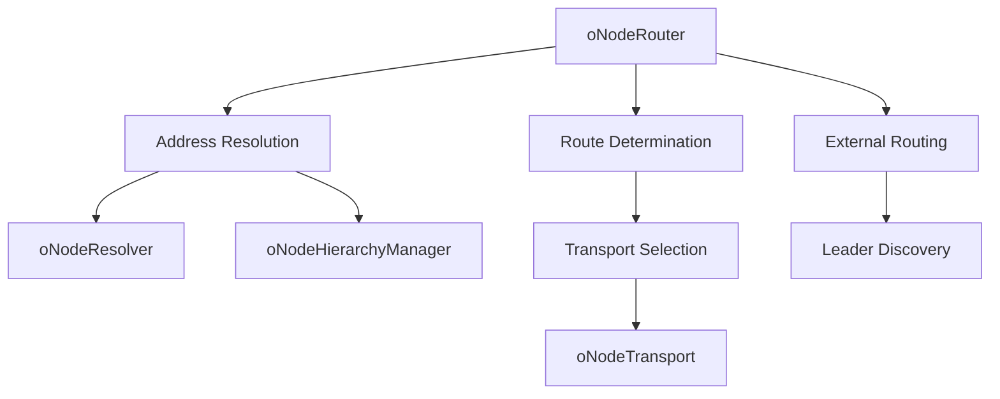

# oNode Router System

The oNode router system provides intelligent address resolution and routing for peer-to-peer communication in Olane networks. It handles hierarchical addressing, external network routing, and transport selection to ensure messages reach their intended destinations efficiently.

## Architecture Overview

The routing system consists of several interconnected components:

1. **oNodeRouter** - Main routing engine that handles address translation and route determination
2. **oNodeAddress** - Enhanced address representation with transport and protocol information
3. **oNodeResolver** - Address resolution logic for finding next hops in the network
4. **oNodeTransport** - Transport abstraction for different communication protocols
5. **oNodeHierarchyManager** - Manages hierarchical relationships between nodes



## oNodeAddress

The oNodeAddress class extends the basic oAddress to provide enhanced addressing capabilities specific to oNode networks.

### Class Definition

```typescript
class oNodeAddress extends oAddress {
  public transports: oNodeTransport[] = [];
  
  constructor(value: string, transports: oNodeTransport[] = []);
  
  get libp2pTransports(): oNodeTransport[];
  get customTransports(): oNodeTransport[];
  get paths(): string;
  get protocol(): string;
  get root(): string;
  
  validate(): boolean;
  toString(): string;
  toMultiaddr(): Multiaddr;
  async toCID(): Promise<CID>;
  setTransports(transports: oNodeTransport[]): void;
}
```

### Address Format

oNode addresses follow the `o://` protocol format with hierarchical path structure:

```typescript
// Basic address
const address = new oNodeAddress('o://my-network/service');

// Hierarchical address
const hierarchicalAddress = new oNodeAddress('o://company/department/team/agent');

// Address with method
const methodAddress = new oNodeAddress('o://api-service/users/create');

// Root network address
const rootAddress = new oNodeAddress('o://network-root');
```

### Address Components

**Protocol and Paths:**

```typescript
const address = new oNodeAddress('o://company/sales/ai-assistant');

console.log('Protocol:', address.protocol);  // '/o/company/sales/ai-assistant'
console.log('Paths:', address.paths);        // 'company/sales/ai-assistant'
console.log('Root:', address.root);          // 'o://company'
```

**Transport Management:**

```typescript
import { multiaddr } from '@multiformats/multiaddr';

const address = new oNodeAddress('o://my-service');

// Add libp2p transports
const transport1 = new oNodeTransport(multiaddr('/ip4/127.0.0.1/tcp/9000/p2p/12D3KooW...'));
const transport2 = new oNodeTransport(multiaddr('/ip4/0.0.0.0/tcp/9001/p2p/12D3KooW...'));

address.setTransports([transport1, transport2]);

// Access different transport types
console.log('LibP2P transports:', address.libp2pTransports);
console.log('Custom transports:', address.customTransports);
```

### Address Validation

```typescript
const address = new oNodeAddress('o://valid-service');
console.log('Is valid:', address.validate()); // true

const invalidAddress = new oNodeAddress('invalid://service');
console.log('Is valid:', invalidAddress.validate()); // false
```

### Address Utilities

**Convert to Multiaddr:**

```typescript
const address = new oNodeAddress('o://service/method');
const multiaddr = address.toMultiaddr();
console.log('Multiaddr:', multiaddr.toString()); // '/o/service/method'
```

**Convert to CID:**

```typescript
const address = new oNodeAddress('o://data-service');
const cid = await address.toCID();
console.log('Content ID:', cid.toString());
```

**Address Comparison:**

```typescript
const addr1 = new oNodeAddress('o://service-a');
const addr2 = new oNodeAddress('o://service-b');

console.log('Are equal:', oNodeAddress.equals(addr1, addr2)); // false
```

## oNodeRouter

The main routing engine that handles address translation and route determination.

### Class Definition

```typescript
class oNodeRouter extends oRouter {
  constructor(config: oNodeRouterConfig);
  
  async translate(address: oNodeAddress): Promise<RouteResponse>;
  isInternal(address: oNodeAddress): boolean;
  getTransports(address: oNodeAddress): oNodeTransport[];
}
```

### Configuration

```typescript
interface oNodeRouterConfig {
  hierarchyManager: oNodeHierarchyManager;
}
```

### Route Translation

The `translate` method is the core of the routing system, determining how to reach a target address:

```typescript
const router = new oNodeRouter({
  hierarchyManager: node.hierarchyManager
});

const route = await router.translate(
  new oNodeAddress('o://external-network/service')
);

console.log('Next hop:', route.nextHopAddress.toString());
console.log('Target:', route.targetAddress.toString());
```

**Route Response:**

```typescript
interface RouteResponse {
  nextHopAddress: oNodeAddress;  // Next hop in the routing path
  targetAddress: oNodeAddress;   // Final destination address
}
```

### Internal vs External Routing

The router distinguishes between internal and external addresses:

**Internal Addresses:**
- Addresses within the current network hierarchy
- Routed directly through hierarchy managers
- Use known parent/child relationships

**External Addresses:**
- Addresses in different networks
- Routed through network leaders
- Require cross-network communication

```typescript
// Check if address is internal to current network
const isInternal = router.isInternal(address);

if (isInternal) {
  console.log('Routing internally through hierarchy');
} else {
  console.log('Routing externally through network leader');
}
```

### Transport Selection

The router selects appropriate transports based on address and network configuration:

```typescript
const transports = router.getTransports(targetAddress);

console.log('Available transports:');
transports.forEach(transport => {
  console.log(`  ${transport.toString()}`);
});
```

## oNodeResolver

Handles address resolution within the network hierarchy.

### Class Definition

```typescript
class oNodeResolver extends oAddressResolver {
  constructor(address: oNodeAddress);
  
  async resolve(
    address: oNodeAddress,
    hierarchy: oHierarchyManager
  ): Promise<oNodeAddress>;
}
```

### Resolution Process

The resolver uses hierarchy information to find the next hop for a given address:

```typescript
const resolver = new oNodeResolver(node.address);

const nextHop = await resolver.resolve(
  targetAddress,
  node.hierarchyManager
);

console.log('Resolved next hop:', nextHop.toString());
```

**Resolution Logic:**
1. Calculate the next address in the path using `oAddress.next()`
2. Look up the child address in the hierarchy
3. Return the child address with transport information
4. Fall back to the original address if no child found

### Custom Resolution

You can extend the resolver for custom resolution logic:

```typescript
class CustomResolver extends oNodeResolver {
  async resolve(
    address: oNodeAddress,
    hierarchy: oHierarchyManager
  ): Promise<oNodeAddress> {
    // Custom resolution logic
    if (address.paths.startsWith('cache/')) {
      return this.resolveCacheAddress(address);
    }
    
    if (address.paths.startsWith('external/')) {
      return this.resolveExternalAddress(address);
    }
    
    // Fall back to default resolution
    return super.resolve(address, hierarchy);
  }
  
  private async resolveCacheAddress(address: oNodeAddress): Promise<oNodeAddress> {
    // Custom cache resolution logic
    const cacheNode = await this.findCacheNode();
    return new oNodeAddress(cacheNode.address, cacheNode.transports);
  }
  
  private async resolveExternalAddress(address: oNodeAddress): Promise<oNodeAddress> {
    // Custom external resolution logic
    const gateway = await this.findExternalGateway();
    return new oNodeAddress(gateway.address, gateway.transports);
  }
}

// Use custom resolver
const customResolver = new CustomResolver(node.address);
node.router.addResolver(customResolver);
```

## oNodeTransport

Abstracts different transport protocols for network communication.

### Class Definition

```typescript
class oNodeTransport extends oTransport {
  public readonly type: TransportType = TransportType.LIBP2P;
  public value: Multiaddr | string;
  
  constructor(value: Multiaddr | string);
  
  toMultiaddr(): Multiaddr;
  toString(): string;
}
```

### Transport Types

```typescript
enum TransportType {
  LIBP2P = 'libp2p',
  WEBSOCKET = 'websocket',
  HTTP = 'http',
  MEMORY = 'memory',
  CUSTOM = 'custom'
}
```

### Creating Transports

**LibP2P Transport:**

```typescript
import { multiaddr } from '@multiformats/multiaddr';

// From multiaddr
const ma = multiaddr('/ip4/127.0.0.1/tcp/9000/p2p/12D3KooW...');
const transport = new oNodeTransport(ma);

// From string
const transport2 = new oNodeTransport('/ip4/0.0.0.0/tcp/9001/p2p/12D3KooW...');

console.log('Transport:', transport.toString());
console.log('Multiaddr:', transport.toMultiaddr().toString());
```

**Memory Transport (for testing):**

```typescript
const memoryTransport = new oNodeTransport('/memory/test-node-123');
console.log('Memory transport:', memoryTransport.toString());
```

### Transport Selection

Filter and select appropriate transports:

```typescript
// Get all transports for an address
const allTransports = address.transports;

// Filter by type
const libp2pTransports = address.libp2pTransports;
const customTransports = address.customTransports;

// Select best transport based on criteria
function selectBestTransport(
  transports: oNodeTransport[],
  criteria: { preferLocal?: boolean; protocol?: string }
): oNodeTransport {
  let candidates = transports;
  
  if (criteria.preferLocal) {
    // Prefer local addresses
    const localTransports = candidates.filter(t => 
      t.toString().includes('127.0.0.1') || t.toString().includes('localhost')
    );
    if (localTransports.length > 0) {
      candidates = localTransports;
    }
  }
  
  if (criteria.protocol) {
    // Filter by protocol
    candidates = candidates.filter(t => 
      t.toString().includes(criteria.protocol!)
    );
  }
  
  // Return first candidate or throw if none available
  if (candidates.length === 0) {
    throw new Error('No suitable transport found');
  }
  
  return candidates[0];
}
```

## oNodeHierarchyManager

Manages hierarchical relationships between nodes in the network.

### Class Definition

```typescript
class oNodeHierarchyManager extends oHierarchyManager {
  public leaders: oNodeAddress[] = [];
  public children: oNodeAddress[] = [];
  public parents: oNodeAddress[] = [];
  
  constructor(config: oNodeHierarchyManagerConfig);
}
```

### Configuration

```typescript
interface oNodeHierarchyManagerConfig extends oHierarchyManagerConfig {
  leaders: oNodeAddress[];
  children: oNodeAddress[];
  parents: oNodeAddress[];
}
```

### Hierarchy Setup

**Basic Hierarchy:**

```typescript
const hierarchyManager = new oNodeHierarchyManager({
  leaders: [new oNodeAddress('o://network-leader')],
  parents: [new oNodeAddress('o://parent-node')],
  children: []
});
```

**Complex Enterprise Hierarchy:**

```typescript
const enterpriseHierarchy = new oNodeHierarchyManager({
  leaders: [
    new oNodeAddress('o://company-network'),
    new oNodeAddress('o://backup-leader')
  ],
  parents: [
    new oNodeAddress('o://company-network/engineering'),
    new oNodeAddress('o://company-network/sales')
  ],
  children: [
    new oNodeAddress('o://company-network/engineering/ai-team/agent-1'),
    new oNodeAddress('o://company-network/engineering/ai-team/agent-2')
  ]
});
```

### Hierarchy Operations

**Managing Children:**

```typescript
// Add child node
const childAddress = new oNodeAddress('o://new-child');
hierarchyManager.addChild(childAddress);

// Remove child node
hierarchyManager.removeChild(childAddress);

// Get child by address
const child = hierarchyManager.getChild(childAddress);
if (child) {
  console.log('Found child:', child.toString());
}
```

**Managing Parents:**

```typescript
// Add parent node
const parentAddress = new oNodeAddress('o://new-parent');
hierarchyManager.addParent(parentAddress);

// Check if node has parents
if (hierarchyManager.parents.length > 0) {
  console.log('Node has parents:', hierarchyManager.parents.map(p => p.toString()));
}
```

**Leader Management:**

```typescript
// Add leader
const leaderAddress = new oNodeAddress('o://network-leader');
hierarchyManager.addLeader(leaderAddress);

// Get primary leader
const primaryLeader = hierarchyManager.leaders[0];
console.log('Primary leader:', primaryLeader?.toString());
```

## Routing Patterns

### Direct Routing

For simple point-to-point communication:

```typescript
async function directRoute(
  router: oNodeRouter,
  targetAddress: oNodeAddress
): Promise<RouteResponse> {
  return await router.translate(targetAddress);
}

// Usage
const route = await directRoute(node.router, targetAddress);
const connection = await node.connect(route.nextHopAddress, route.targetAddress);
```

### Hierarchical Routing

For communication within organizational hierarchies:

```typescript
class HierarchicalRouter {
  private router: oNodeRouter;
  private hierarchy: oNodeHierarchyManager;
  
  constructor(router: oNodeRouter, hierarchy: oNodeHierarchyManager) {
    this.router = router;
    this.hierarchy = hierarchy;
  }
  
  async routeToSibling(siblingAddress: oNodeAddress): Promise<RouteResponse> {
    // Route through common parent
    const parent = this.hierarchy.parents[0];
    if (!parent) {
      throw new Error('No parent found for sibling routing');
    }
    
    return {
      nextHopAddress: parent,
      targetAddress: siblingAddress
    };
  }
  
  async routeToChild(childAddress: oNodeAddress): Promise<RouteResponse> {
    // Direct route to child
    const child = this.hierarchy.getChild(childAddress);
    if (!child) {
      throw new Error('Child not found in hierarchy');
    }
    
    return {
      nextHopAddress: child as oNodeAddress,
      targetAddress: childAddress
    };
  }
  
  async routeToParent(parentAddress: oNodeAddress): Promise<RouteResponse> {
    // Direct route to parent
    const parent = this.hierarchy.parents.find(p => 
      oNodeAddress.equals(p, parentAddress)
    );
    
    if (!parent) {
      throw new Error('Parent not found in hierarchy');
    }
    
    return {
      nextHopAddress: parent,
      targetAddress: parentAddress
    };
  }
}
```

### Cross-Network Routing

For communication between different networks:

```typescript
class CrossNetworkRouter {
  private router: oNodeRouter;
  
  constructor(router: oNodeRouter) {
    this.router = router;
  }
  
  async routeExternal(externalAddress: oNodeAddress): Promise<RouteResponse> {
    // Check if address is external
    if (this.router.isInternal(externalAddress)) {
      throw new Error('Address is not external');
    }
    
    // Route through network leader
    const route = await this.router.translate(externalAddress);
    
    // Add external routing metadata
    return {
      ...route,
      metadata: {
        type: 'external',
        sourceNetwork: this.getCurrentNetwork(),
        targetNetwork: this.extractNetwork(externalAddress)
      }
    };
  }
  
  private getCurrentNetwork(): string {
    // Extract current network from node address
    return 'current-network'; // Implementation specific
  }
  
  private extractNetwork(address: oNodeAddress): string {
    // Extract target network from address
    return address.root;
  }
}
```

### Load-Balanced Routing

For distributing traffic across multiple endpoints:

```typescript
class LoadBalancedRouter {
  private endpoints: oNodeAddress[] = [];
  private currentIndex = 0;
  
  constructor(endpoints: oNodeAddress[]) {
    this.endpoints = endpoints;
  }
  
  async getNextEndpoint(): Promise<oNodeAddress> {
    if (this.endpoints.length === 0) {
      throw new Error('No endpoints available');
    }
    
    const endpoint = this.endpoints[this.currentIndex];
    this.currentIndex = (this.currentIndex + 1) % this.endpoints.length;
    
    return endpoint;
  }
  
  async routeWithLoadBalancing(
    router: oNodeRouter,
    serviceAddress: string
  ): Promise<RouteResponse> {
    // Select next endpoint
    const endpoint = await this.getNextEndpoint();
    
    // Create target address
    const targetAddress = new oNodeAddress(`${endpoint.toString()}${serviceAddress}`);
    
    // Route to selected endpoint
    return await router.translate(targetAddress);
  }
}

// Usage
const loadBalancer = new LoadBalancedRouter([
  new oNodeAddress('o://worker-1'),
  new oNodeAddress('o://worker-2'),
  new oNodeAddress('o://worker-3')
]);

const route = await loadBalancer.routeWithLoadBalancing(
  node.router,
  '/process-task'
);
```

## Advanced Routing Features

### Custom Routing Policies

Implement custom routing policies based on various criteria:

```typescript
interface RoutingPolicy {
  name: string;
  priority: number;
  canHandle(address: oNodeAddress): boolean;
  route(address: oNodeAddress): Promise<RouteResponse>;
}

class GeographicRoutingPolicy implements RoutingPolicy {
  name = 'geographic';
  priority = 10;
  
  canHandle(address: oNodeAddress): boolean {
    return address.paths.includes('/geo/');
  }
  
  async route(address: oNodeAddress): Promise<RouteResponse> {
    // Extract geographic information
    const region = this.extractRegion(address);
    const nearestNode = await this.findNearestNode(region);
    
    return {
      nextHopAddress: nearestNode,
      targetAddress: address
    };
  }
  
  private extractRegion(address: oNodeAddress): string {
    // Extract region from address path
    const parts = address.paths.split('/');
    const geoIndex = parts.indexOf('geo');
    return geoIndex >= 0 && geoIndex < parts.length - 1 ? parts[geoIndex + 1] : 'default';
  }
  
  private async findNearestNode(region: string): Promise<oNodeAddress> {
    // Find nearest node for region
    const regionNodes = {
      'us-east': new oNodeAddress('o://us-east-gateway'),
      'us-west': new oNodeAddress('o://us-west-gateway'),
      'europe': new oNodeAddress('o://europe-gateway'),
      'default': new oNodeAddress('o://global-gateway')
    };
    
    return regionNodes[region] || regionNodes.default;
  }
}

class PolicyBasedRouter extends oNodeRouter {
  private policies: RoutingPolicy[] = [];
  
  addPolicy(policy: RoutingPolicy) {
    this.policies.push(policy);
    // Sort by priority (higher priority first)
    this.policies.sort((a, b) => b.priority - a.priority);
  }
  
  async translate(address: oNodeAddress): Promise<RouteResponse> {
    // Try custom policies first
    for (const policy of this.policies) {
      if (policy.canHandle(address)) {
        return await policy.route(address);
      }
    }
    
    // Fall back to default routing
    return super.translate(address);
  }
}
```

### Route Caching

Cache routing decisions to improve performance:

```typescript
class CachedRouter extends oNodeRouter {
  private routeCache = new Map<string, { route: RouteResponse; timestamp: number }>();
  private cacheTimeout = 300000; // 5 minutes
  
  async translate(address: oNodeAddress): Promise<RouteResponse> {
    const cacheKey = address.toString();
    const cached = this.routeCache.get(cacheKey);
    
    // Check if cached route is still valid
    if (cached && Date.now() - cached.timestamp < this.cacheTimeout) {
      return cached.route;
    }
    
    // Compute new route
    const route = await super.translate(address);
    
    // Cache the result
    this.routeCache.set(cacheKey, {
      route,
      timestamp: Date.now()
    });
    
    // Clean up expired entries
    this.cleanupCache();
    
    return route;
  }
  
  private cleanupCache() {
    const now = Date.now();
    for (const [key, value] of this.routeCache.entries()) {
      if (now - value.timestamp > this.cacheTimeout) {
        this.routeCache.delete(key);
      }
    }
  }
  
  clearCache() {
    this.routeCache.clear();
  }
}
```

### Route Monitoring

Monitor routing performance and health:

```typescript
class RouteMonitor {
  private routeStats = new Map<string, RouteStats>();
  
  recordRoute(address: string, latency: number, success: boolean) {
    const stats = this.routeStats.get(address) || {
      totalRequests: 0,
      successfulRequests: 0,
      averageLatency: 0,
      lastUsed: new Date()
    };
    
    stats.totalRequests++;
    if (success) {
      stats.successfulRequests++;
    }
    
    // Update average latency
    const alpha = 0.1; // Exponential moving average factor
    stats.averageLatency = alpha * latency + (1 - alpha) * stats.averageLatency;
    stats.lastUsed = new Date();
    
    this.routeStats.set(address, stats);
  }
  
  getRouteHealth(address: string): RouteHealth {
    const stats = this.routeStats.get(address);
    if (!stats) {
      return { healthy: false, reason: 'No data available' };
    }
    
    const successRate = stats.successfulRequests / stats.totalRequests;
    const isHealthy = successRate > 0.9 && stats.averageLatency < 5000; // 90% success, <5s latency
    
    return {
      healthy: isHealthy,
      successRate,
      averageLatency: stats.averageLatency,
      totalRequests: stats.totalRequests,
      reason: isHealthy ? 'Route is healthy' : 'Route has performance issues'
    };
  }
  
  getTopRoutes(limit: number = 10): Array<{ address: string; stats: RouteStats }> {
    return Array.from(this.routeStats.entries())
      .sort(([, a], [, b]) => b.totalRequests - a.totalRequests)
      .slice(0, limit)
      .map(([address, stats]) => ({ address, stats }));
  }
}

interface RouteStats {
  totalRequests: number;
  successfulRequests: number;
  averageLatency: number;
  lastUsed: Date;
}

interface RouteHealth {
  healthy: boolean;
  successRate?: number;
  averageLatency?: number;
  totalRequests?: number;
  reason: string;
}
```

## Troubleshooting Routing Issues

### Common Routing Problems

1. **Address Not Found:**

```typescript
try {
  const route = await router.translate(address);
} catch (error) {
  if (error.message.includes('No leader transports provided')) {
    console.error('Network configuration issue - no leaders configured');
    // Check hierarchy manager configuration
  }
}
```

2. **External Routing Failures:**

```typescript
const isInternal = router.isInternal(address);
if (!isInternal && !hierarchyManager.leaders.length) {
  console.error('Cannot route external address - no leaders configured');
}
```

3. **Transport Selection Issues:**

```typescript
try {
  const transports = router.getTransports(address);
  if (transports.length === 0) {
    console.error('No transports available for address:', address.toString());
  }
} catch (error) {
  console.error('Transport selection failed:', error.message);
}
```

### Debugging Tools

**Route Tracing:**

```typescript
class RouteTracer {
  async traceRoute(
    router: oNodeRouter,
    startAddress: oNodeAddress,
    targetAddress: oNodeAddress
  ): Promise<RouteTrace> {
    const trace: RouteTrace = {
      start: startAddress.toString(),
      target: targetAddress.toString(),
      hops: [],
      success: false,
      error: null
    };
    
    try {
      let currentAddress = startAddress;
      const maxHops = 10; // Prevent infinite loops
      
      for (let i = 0; i < maxHops; i++) {
        const route = await router.translate(targetAddress);
        
        trace.hops.push({
          hop: i + 1,
          from: currentAddress.toString(),
          to: route.nextHopAddress.toString(),
          target: route.targetAddress.toString()
        });
        
        // Check if we've reached the target
        if (oNodeAddress.equals(route.nextHopAddress, targetAddress)) {
          trace.success = true;
          break;
        }
        
        currentAddress = route.nextHopAddress;
      }
      
      if (!trace.success && trace.hops.length >= maxHops) {
        trace.error = 'Maximum hops exceeded - possible routing loop';
      }
      
    } catch (error) {
      trace.error = error.message;
    }
    
    return trace;
  }
}

interface RouteTrace {
  start: string;
  target: string;
  hops: Array<{
    hop: number;
    from: string;
    to: string;
    target: string;
  }>;
  success: boolean;
  error: string | null;
}
```

**Route Validation:**

```typescript
class RouteValidator {
  async validateRoute(route: RouteResponse): Promise<ValidationResult> {
    const issues: string[] = [];
    
    // Check if addresses are valid
    if (!route.nextHopAddress.validate()) {
      issues.push('Next hop address is invalid');
    }
    
    if (!route.targetAddress.validate()) {
      issues.push('Target address is invalid');
    }
    
    // Check if transports are available
    if (route.nextHopAddress.transports.length === 0) {
      issues.push('Next hop has no available transports');
    }
    
    // Check transport reachability
    const reachable = await this.checkTransportReachability(
      route.nextHopAddress.transports
    );
    
    if (!reachable) {
      issues.push('Next hop transports are not reachable');
    }
    
    return {
      valid: issues.length === 0,
      issues
    };
  }
  
  private async checkTransportReachability(
    transports: oNodeTransport[]
  ): Promise<boolean> {
    // Implementation would check actual network reachability
    // This is a simplified version
    return transports.length > 0;
  }
}

interface ValidationResult {
  valid: boolean;
  issues: string[];
}
```

The oNode router system provides a flexible and powerful foundation for address resolution and routing in peer-to-peer networks. By understanding the components and patterns outlined in this guide, you can build robust routing solutions that scale from simple point-to-point communication to complex hierarchical networks.
