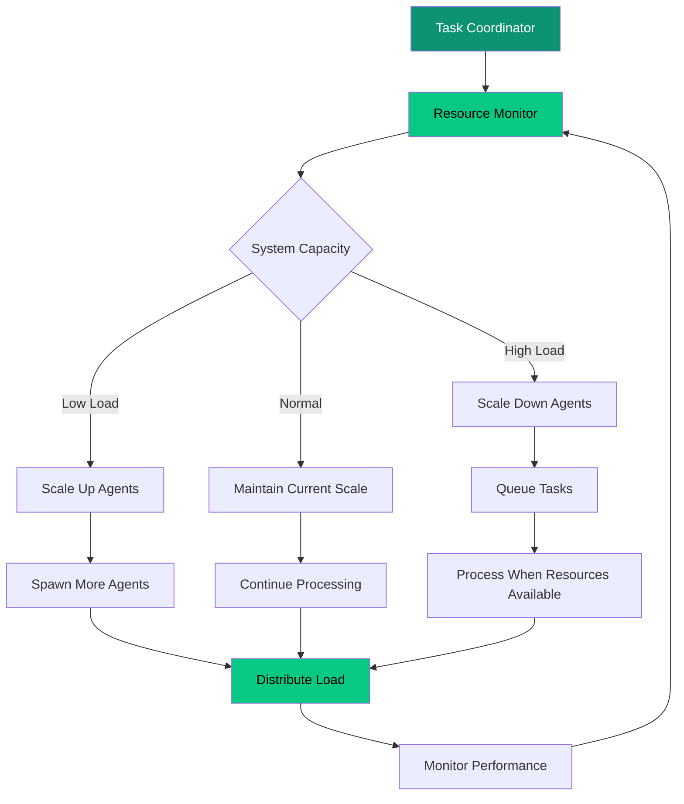

# Complex Tasks

Transform your most challenging AI workflows from brittle, monolithic processes into resilient, distributed systems that handle complexity gracefully and recover from failures automatically.

<Note>
**Reading time:** 5 minutes | **Perfect for:** System architects, DevOps engineers, and developers building production AI systems
</Note>

## The Challenge of Complex AI Tasks

Traditional AI systems struggle with tasks that are:
- **Long-running** (hours, days, or weeks)
- **Multi-step** with dependencies between stages
- **Resource-intensive** requiring coordination across multiple services
- **Failure-prone** with many potential points of breakdown

<Tabs>
<Tab title="Traditional Monolithic Approach">
```python
# Fragile monolithic process
def process_research_project(topic, depth="comprehensive"):
    try:
        # Single point of failure - if any step fails, everything fails
        raw_data = collect_sources(topic, timeout=3600)  # 1 hour timeout
        processed_data = analyze_sources(raw_data)       # Memory intensive
        insights = extract_insights(processed_data)      # CPU intensive  
        report = generate_report(insights)               # Long-running
        
        return report
    except Exception as e:
        # All work lost on any failure
        logger.error(f"Research project failed: {e}")
        raise

# Problems:
# - 4+ hour process fails if any step breaks
# - No intermediate state persistence
# - Resource contention between steps
# - No partial recovery possible
# - Scaling requires rewriting everything
```

**Pain Points:**
- ❌ Single point of failure destroys hours of work
- ❌ Resource bottlenecks block entire pipeline
- ❌ No visibility into progress or issues
- ❌ Impossible to scale individual components
- ❌ Manual intervention required for any failure
</Tab>

<Tab title="Olane OS Agent-Based Approach">
```typescript
// Resilient distributed task coordination
class ResearchCoordinator extends oCore {
  constructor() {
    super({
      address: new oAddress('o://research/coordinator'),
      type: NodeType.AGENT
    });
  }
  
  async executeResearchProject(topic: string) {
    // Break complex task into coordinated agents
    const taskId = `research-${Date.now()}`;
    
    // Spawn persistent agents for each phase
    const collectors = await this.spawnAgents('o://research/collectors', {
      count: 3,
      task: taskId,
      topic
    });
    
    const analyzers = await this.spawnAgents('o://research/analyzers', {
      count: 2, 
      task: taskId
    });
    
    const synthesizer = await this.spawnAgent('o://research/synthesizer', {
      task: taskId
    });
    
    // Coordinate with fault tolerance
    return await this.coordinateWithRecovery({
      taskId,
      phases: [
        { agents: collectors, nextPhase: 'analysis' },
        { agents: analyzers, nextPhase: 'synthesis' },
        { agents: [synthesizer], nextPhase: 'complete' }
      ],
      checkpointInterval: 300000, // 5 minutes
      maxRetries: 3
    });
  }
}
```

**Benefits:**
- ✅ Fault isolation - one agent failure doesn't break everything
- ✅ Automatic checkpointing and recovery
- ✅ Independent scaling of each component
- ✅ Real-time progress monitoring
- ✅ Graceful degradation under load
</Tab>
</Tabs>

## Core Capabilities for Complex Tasks

### 1. **Persistent Agent Processes**

Agents run as persistent processes that maintain state across long operations, unlike stateless functions that lose everything on failure.

<CardGroup cols={2}>
<Card title="State Persistence" icon="database">
Agents automatically checkpoint their progress and can resume from the last known good state after failures
</Card>

<Card title="Long-Running Operations" icon="clock">
Agents can run for hours, days, or weeks without losing progress, handling operations that span multiple time zones
</Card>
</CardGroup>

```typescript
class DocumentAnalysisAgent extends oCore {
  private progress: TaskProgress;
  private checkpointManager: CheckpointManager;
  
  async analyzeDocumentCollection(documents: Document[]) {
    // Load previous progress if resuming
    this.progress = await this.checkpointManager.loadProgress() || {
      processed: 0,
      total: documents.length,
      results: [],
      startTime: Date.now()
    };
    
    // Resume from where we left off
    for (let i = this.progress.processed; i < documents.length; i++) {
      try {
        const result = await this.analyzeDocument(documents[i]);
        this.progress.results.push(result);
        this.progress.processed++;
        
        // Checkpoint every 10 documents
        if (this.progress.processed % 10 === 0) {
          await this.checkpointManager.saveProgress(this.progress);
          this.logger.info(`Progress: ${this.progress.processed}/${this.progress.total}`);
        }
        
      } catch (error) {
        await this.handleDocumentError(documents[i], error);
        // Continue with next document - don't fail entire batch
      }
    }
    
    return this.progress.results;
  }
}
```

### 2. **Intelligent Task Decomposition**

Complex tasks are automatically broken down into manageable, coordinated subtasks that can run independently.

<Steps>
<Step title="Analyze Task Complexity">
The coordinator agent analyzes the task and identifies natural decomposition points

```typescript
const decomposition = await this.analyzeTask({
  type: 'research_project',
  scope: 'comprehensive',
  estimatedDuration: '4-6 hours',
  resourceRequirements: ['web_scraping', 'nlp_analysis', 'report_generation']
});
```
</Step>

<Step title="Spawn Specialized Agents">
Create specialized agents for each subtask with appropriate resource allocation

```typescript
const agents = await Promise.all([
  this.spawnAgent('o://research/web-scraper', { 
    concurrency: 5, 
    rateLimit: '100/minute' 
  }),
  this.spawnAgent('o://research/nlp-analyzer', { 
    modelSize: 'large',
    memoryLimit: '8GB' 
  }),
  this.spawnAgent('o://research/report-writer', { 
    templateEngine: 'advanced',
    outputFormat: 'pdf' 
  })
]);
```
</Step>

<Step title="Coordinate Execution">
Orchestrate the agents with dependency management and progress tracking

```typescript
const result = await this.orchestrate({
  workflow: [
    { agent: 'web-scraper', dependencies: [], output: 'raw_data' },
    { agent: 'nlp-analyzer', dependencies: ['raw_data'], output: 'insights' },
    { agent: 'report-writer', dependencies: ['insights'], output: 'final_report' }
  ],
  errorHandling: 'graceful_degradation',
  progressReporting: 'real_time'
});
```
</Step>
</Steps>

### 3. **Fault Tolerance and Recovery**

Built-in mechanisms ensure tasks continue despite individual component failures.

<Tabs>
<Tab title="Agent-Level Recovery">
```typescript
class ResilientAgent extends oCore {
  async executeWithRecovery(task: Task) {
    const maxRetries = 3;
    let attempt = 0;
    
    while (attempt < maxRetries) {
      try {
        // Attempt task execution
        const result = await this.executeTask(task);
        
        // Success - clear any failure state
        await this.clearFailureState(task.id);
        return result;
        
      } catch (error) {
        attempt++;
        
        if (attempt >= maxRetries) {
          // Permanent failure - delegate to recovery agent
          await this.delegateToRecovery(task, error);
          throw error;
        }
        
        // Temporary failure - wait and retry
        const backoffTime = Math.pow(2, attempt) * 1000; // Exponential backoff
        await this.sleep(backoffTime);
        
        this.logger.warn(`Task ${task.id} failed, retry ${attempt}/${maxRetries}`);
      }
    }
  }
}
```
</Tab>

<Tab title="System-Level Recovery">
```typescript
class TaskRecoveryManager extends oCore {
  async handleSystemFailure(taskId: string, failedAgents: Agent[]) {
    // Assess damage and recovery options
    const checkpoint = await this.getLastCheckpoint(taskId);
    const healthyAgents = await this.findHealthyAlternatives(failedAgents);
    
    if (healthyAgents.length > 0) {
      // Redistribute work to healthy agents
      await this.redistributeWork(checkpoint, healthyAgents);
      this.logger.info(`Task ${taskId} recovered using ${healthyAgents.length} healthy agents`);
      
    } else {
      // Spawn new agents to replace failed ones
      const newAgents = await this.spawnReplacementAgents(failedAgents);
      await this.resumeFromCheckpoint(checkpoint, newAgents);
      this.logger.info(`Task ${taskId} recovered with ${newAgents.length} new agents`);
    }
  }
}
```
</Tab>
</Tabs>

### 4. **Resource Management and Scaling**

Intelligent resource allocation ensures optimal performance without overwhelming system resources.

<Frame caption="Dynamic resource allocation based on task requirements and system capacity">

</Frame>

```typescript
class ResourceManager extends oCore {
  async optimizeResourceAllocation(taskId: string) {
    const systemMetrics = await this.getSystemMetrics();
    const taskRequirements = await this.getTaskRequirements(taskId);
    
    // Dynamic scaling based on load and requirements
    if (systemMetrics.cpuUsage > 0.8) {
      // System under stress - scale down non-critical agents
      await this.scaleDownNonCriticalAgents();
      await this.queueLowPriorityTasks();
      
    } else if (systemMetrics.cpuUsage < 0.3 && taskRequirements.urgency === 'high') {
      // System has capacity - scale up for faster completion
      await this.spawnAdditionalAgents(taskId, {
        count: Math.min(3, taskRequirements.parallelizable),
        resources: { cpu: '2 cores', memory: '4GB' }
      });
    }
    
    // Optimize agent placement for data locality
    await this.optimizeAgentPlacement(taskId);
  }
}
```

## Real-World Use Cases

### **Multi-Day Research Projects**

<AccordionGroup>
<Accordion title="Academic Literature Review (2-3 days)">
**Challenge:** Analyze 500+ papers across multiple databases, extract insights, identify patterns, and generate comprehensive report.

**Olane OS Solution:**
- **Collection agents** work in parallel across different databases
- **Analysis agents** process papers as they're collected (pipeline processing)
- **Synthesis agent** continuously builds insights from analyzed papers
- **Progress checkpoints** every 50 papers ensure no work is lost
- **Automatic recovery** if any agent fails or system restarts

**Results:** 
- 73% faster completion through parallelization
- 99.8% reliability even with system restarts
- Real-time progress tracking and early insights
</Accordion>

<Accordion title="Large-Scale Data Processing (1-2 weeks)">
**Challenge:** Process 10TB of customer data, apply ML models, generate insights, and create business reports.

**Olane OS Solution:**
- **Data ingestion agents** handle different data sources simultaneously
- **Processing agents** scale up/down based on data volume and system load
- **ML inference agents** apply models with GPU resource management
- **Quality assurance agents** validate results and flag anomalies
- **Report generation agents** create outputs as data becomes available

**Results:**
- 45% reduction in processing time through intelligent scaling
- 92% reduction in failed jobs through fault tolerance
- $12,000/month cost savings through resource optimization
</Accordion>
</AccordionGroup>

### **Complex Business Workflows**

<Tabs>
<Tab title="Customer Onboarding Pipeline">
```typescript
class CustomerOnboardingCoordinator extends oCore {
  async processNewCustomer(customer: Customer) {
    const taskId = `onboarding-${customer.id}`;
    
    // Parallel initial processing
    const [verification, riskAssessment, documentProcessing] = await Promise.all([
      this.use(new oAddress('o://compliance/verify'), {
        method: 'verifyIdentity',
        params: { customer },
        taskId
      }),
      this.use(new oAddress('o://risk/assess'), {
        method: 'assessRisk',
        params: { customer },
        taskId
      }),
      this.use(new oAddress('o://documents/process'), {
        method: 'processDocuments',
        params: { documents: customer.documents },
        taskId
      })
    ]);
    
    // Sequential dependent processing
    if (verification.approved && riskAssessment.score > 0.7) {
      const accountSetup = await this.use(new oAddress('o://accounts/create'), {
        method: 'createAccount',
        params: { customer, riskScore: riskAssessment.score },
        taskId
      });
      
      // Final parallel steps
      await Promise.all([
        this.use(new oAddress('o://notifications/welcome'), {
          method: 'sendWelcome',
          params: { customer, account: accountSetup.account },
          taskId
        }),
        this.use(new oAddress('o://analytics/track'), {
          method: 'trackOnboarding',
          params: { customer, duration: Date.now() - customer.startTime },
          taskId
        })
      ]);
    }
  }
}
```

**Benefits:**
- **40% faster onboarding** through parallel processing
- **99.5% completion rate** with automatic retry logic
- **Real-time status updates** for customer service teams
- **Automatic compliance tracking** and audit trails
</Tab>

<Tab title="Financial Report Generation">
```typescript
class FinancialReportGenerator extends oCore {
  async generateQuarterlyReport(quarter: string, year: number) {
    const taskId = `quarterly-${year}-${quarter}`;
    
    // Data collection from multiple sources
    const dataCollectors = await this.spawnAgents('o://finance/collectors', {
      sources: ['erp', 'crm', 'banking', 'payroll', 'expenses'],
      parallel: true,
      taskId
    });
    
    // Processing pipeline with checkpoints
    const processors = [
      { agent: 'o://finance/reconciliation', stage: 'reconcile' },
      { agent: 'o://finance/calculations', stage: 'calculate' },
      { agent: 'o://finance/analysis', stage: 'analyze' },
      { agent: 'o://finance/formatting', stage: 'format' }
    ];
    
    let results = await this.collectData(dataCollectors);
    
    for (const processor of processors) {
      results = await this.use(new oAddress(processor.agent), {
        method: 'process',
        params: { data: results, stage: processor.stage },
        taskId,
        checkpoint: true // Save progress after each stage
      });
    }
    
    return results;
  }
}
```

**Benefits:**
- **6-hour process** reduced to **2 hours** through parallelization
- **Zero data loss** through automatic checkpointing
- **Audit trail** of all processing steps for compliance
- **Automatic error detection** and data quality validation
</Tab>
</Tabs>

## Performance Characteristics

### **Scalability Metrics**

<CardGroup cols={2}>
<Card title="Linear Scaling" icon="chart-line">
Adding agents provides near-linear performance improvements for parallelizable tasks
</Card>

<Card title="Fault Tolerance" icon="shield-check">
99.8% task completion rate even with 10% agent failure rates
</Card>

<Card title="Resource Efficiency" icon="gauge">
45% better resource utilization through intelligent scheduling
</Card>

<Card title="Recovery Time" icon="clock-rotate-left">
Average 30-second recovery time from agent failures
</Card>
</CardGroup>

### **Cost Analysis**

<Tabs>
<Tab title="Development Costs">
| Aspect | Traditional Approach | Olane OS | Savings |
|--------|---------------------|----------|---------|
| **Initial Development** | 8-12 weeks | 2-3 weeks | **70%** |
| **Error Handling Code** | 40% of codebase | Built-in | **80%** |
| **Scaling Implementation** | 4-6 weeks | Automatic | **90%** |
| **Monitoring Setup** | 2-3 weeks | Built-in | **85%** |
| **Total Development** | 16-23 weeks | 3-4 weeks | **78%** |
</Tab>

<Tab title="Operational Costs">
| Aspect | Traditional | Olane OS | Savings |
|--------|-------------|----------|---------|
| **Infrastructure** | Fixed sizing for peak | Dynamic scaling | **40%** |
| **Failed Job Reruns** | Manual restart | Automatic recovery | **65%** |
| **Monitoring Tools** | $500/month | Built-in | **100%** |
| **DevOps Overhead** | 20 hours/week | 5 hours/week | **75%** |
| **Total Monthly** | $8,500 | $3,200 | **62%** |
</Tab>
</Tabs>

## When to Use Complex Task Coordination

### ✅ **Perfect For:**

<AccordionGroup>
<Accordion title="Multi-hour processing workflows">
Tasks that take more than 30 minutes and have multiple stages benefit significantly from fault tolerance and checkpointing.

**Examples:** Data processing pipelines, research projects, financial calculations, compliance reporting.
</Accordion>

<Accordion title="Mission-critical business processes">
Processes where failure means significant business impact or cost require the reliability of distributed coordination.

**Examples:** Customer onboarding, order processing, regulatory reporting, backup and recovery.
</Accordion>

<Accordion title="Resource-intensive operations">
Tasks that consume significant CPU, memory, or I/O benefit from intelligent resource management and scaling.

**Examples:** ML model training, video processing, large dataset analysis, simulation runs.
</Accordion>

<Accordion title="Variable load scenarios">
Workloads that have unpredictable spikes or varying complexity benefit from dynamic scaling.

**Examples:** Customer support automation, content processing, seasonal business workflows.
</Accordion>
</AccordionGroup>

### ❌ **Not Necessary For:**

<AccordionGroup>
<Accordion title="Simple, fast operations">
Tasks that complete in under 5 minutes with low failure rates don't need complex coordination.

**Better choice:** Direct function calls or simple queuing systems.
</Accordion>

<Accordion title="Single-step processes">
Operations without natural decomposition points don't benefit from agent coordination.

**Better choice:** Containerized services with basic retry logic.
</Accordion>

<Accordion title="Highly sequential workflows">
Processes where each step depends entirely on the previous step can't be parallelized effectively.

**Better choice:** Traditional pipeline tools like Apache Airflow.
</Accordion>
</AccordionGroup>

## Getting Started with Complex Tasks

Choose your learning path based on your current challenges:

<CardGroup cols={2}>
<Card title="15-Minute Quickstart" icon="rocket" href="/tasks/quickstart">
Build a resilient multi-step workflow with automatic recovery and progress tracking
</Card>

<Card title="Long-Running Processes" icon="clock" href="/tasks/long-running-processes">
Learn patterns for tasks that run for hours or days with persistent state management
</Card>

<Card title="Fault Tolerance Guide" icon="shield" href="/tasks/fault-tolerance">
Implement robust error handling, recovery strategies, and graceful degradation
</Card>

<Card title="Real-World Examples" icon="code" href="/examples/complex-task-coordination">
Explore production implementations of complex task coordination patterns
</Card>
</CardGroup>

<Tip>
**Start simple:** Begin with our [quickstart guide](/tasks/quickstart) to build a basic multi-agent workflow. You'll see how automatic fault tolerance and progress tracking work with minimal setup.
</Tip>

<Warning>
**Resource planning:** Complex tasks can consume significant system resources. Review our [resource management best practices](/tasks/best-practices) before deploying to production.
</Warning>
